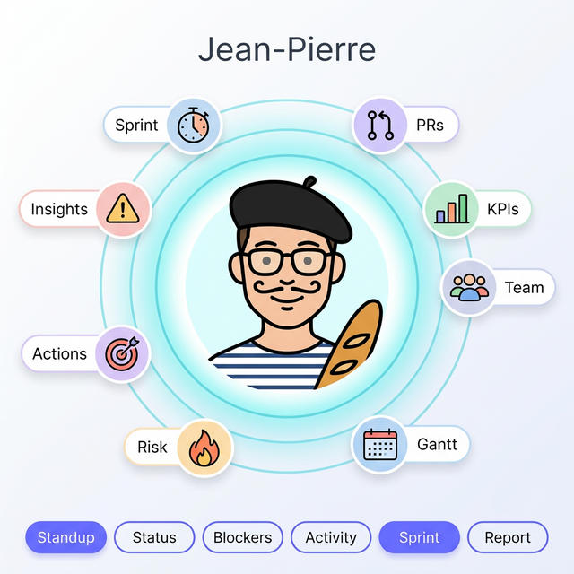
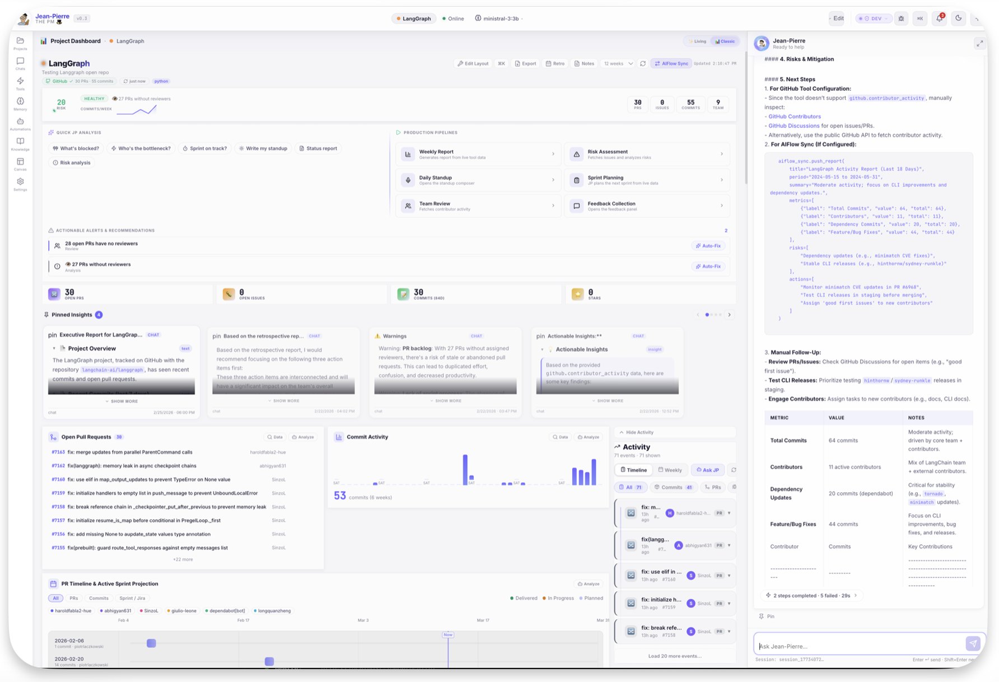
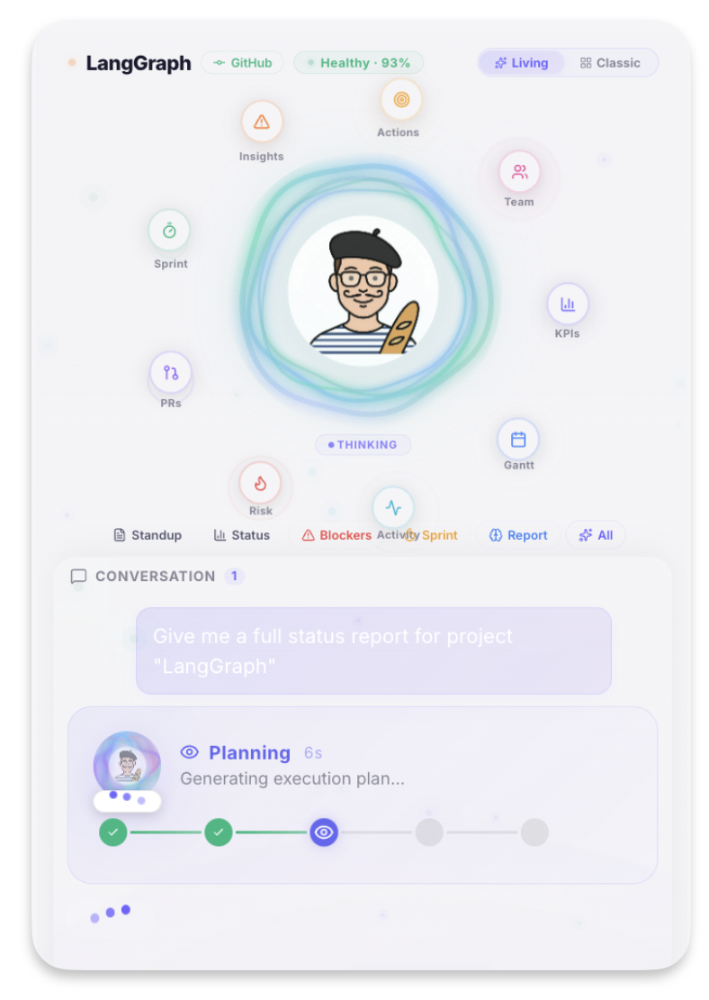
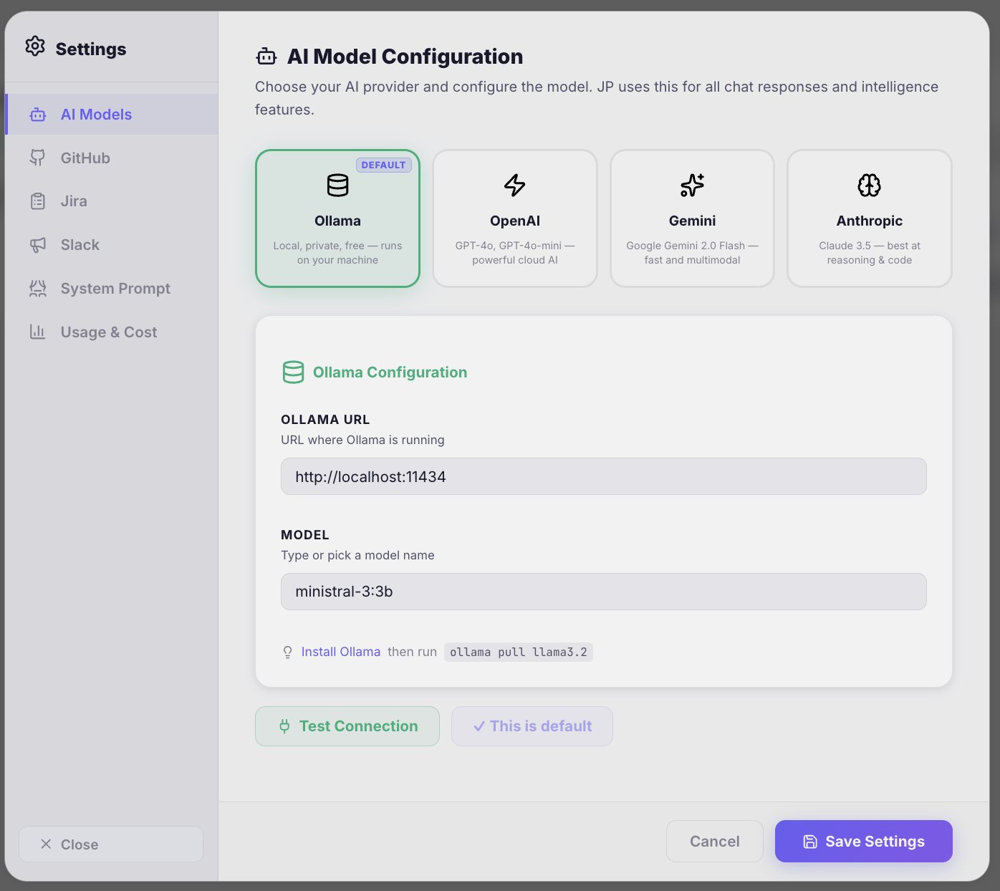

<div align="center">

# AgentOS

### 🤖 Local-First AI Agents for Your Workflow

**Private. Powerful. Customizable.**

[](https://github.com/UnicoLab/agentos/releases/latest)
[](mailto:info@unicolab.ai)
[](https://unicolab.github.io/agentos)

[📥 Download](https://github.com/UnicoLab/agentos/releases/latest) · [📖 Documentation](https://unicolab.github.io/agentos) · [📧 Request License](mailto:info@unicolab.ai) · [🐛 Report Bug](https://github.com/UnicoLab/agentos/issues)

---



</div>

---

## What is AgentOS?

**AgentOS** is an AI-powered agent platform that runs **entirely on your machine**. It connects to your development tools — GitHub, Jira, Slack — and gives you a premium intelligence dashboard with a natural-language AI copilot.

> ⚠️ **License Required** — AgentOS requires a valid license key. Email **[info@unicolab.ai](mailto:info@unicolab.ai)** for a **free testing license**.

> 🧪 **R&D Project** — This is an experimental autonomous compute node for project management. Currently offering **free access to the PM flavor** in exchange for feedback. There may be bugs — your reports help us improve!

### 🔒 Your data stays on YOUR machine

All project data, conversations, memories, and configurations are stored locally. API keys (GitHub, Jira, etc.) are stored securely in `~/.agentos/config.yaml` and **never transmitted to UnicoLab**. The only external communication is for license validation and optional anonymized usage statistics.

### 🔓 No Vendor Lock-In

You have **full control** over which AI model to use, which prompts to configure, and which tools to enable. Switch between Ollama (free, local), OpenAI, Anthropic, or Gemini at any time. Customize everything to your needs.

> See our full [Security & Privacy](https://unicolab.github.io/agentos/security/) page for details.

---

## ⚡ Quick Start

### 1. Download

Grab the latest release for your platform:

| Platform | Download |
|----------|----------|
| **macOS** (Apple Silicon) | [Download .tar.gz](https://github.com/UnicoLab/agentos/releases/latest) |
| **macOS** (Intel) | [Download .tar.gz](https://github.com/UnicoLab/agentos/releases/latest) |
| **Linux** (x86_64) | [Download .tar.gz](https://github.com/UnicoLab/agentos/releases/latest) |
| **Linux** (ARM64) | [Download .tar.gz](https://github.com/UnicoLab/agentos/releases/latest) |
| **Windows** (x86_64) | [Download .zip](https://github.com/UnicoLab/agentos/releases/latest) |

### 2. Install

```bash
# Extract (macOS/Linux)
tar xzf agentos_*.tar.gz

# Move to PATH (run from anywhere)
sudo mv agentos /usr/local/bin/

# macOS only: remove quarantine
sudo xattr -rd com.apple.quarantine /usr/local/bin/agentos
```

### 3. Setup & Launch

```bash
# Interactive setup wizard
agentos setup

# Start the server (opens browser automatically)
agentos serve
```

That's it! 🎉 Open `http://localhost:18080` and start talking to your AI agent.

> 📖 **Detailed guides:** [Installation](https://unicolab.github.io/agentos/getting-started/installation/) · [Ollama Setup](https://unicolab.github.io/agentos/guides/ollama-setup/) · [GitHub Setup](https://unicolab.github.io/agentos/guides/github-setup/)

---

## ✨ Features

<table>
<tr>
<td width="50%">

### 🤖 AI Copilot
Streaming chat with **Ollama** (free, local), OpenAI, Anthropic, or Gemini. Agent memory that learns your preferences.

### 📊 24-Card Dashboard
KPIs, Risk Radar, Velocity Charts, Gantt, Heatmaps, Sprint Status, Team Leaderboard — all drag-and-drop.

### 🐙 GitHub Integration
Multi-repo: PRs, commits, issues, contributor activity. AI-powered reviewer suggestions.

### 📋 Jira Integration
Multi-board: sprint status, epics, mind map. Cross-referenced with GitHub data.

</td>
<td width="50%">

### 🧠 Agent Memory
Auto-extracts facts, preferences, and corrections. Remembers everything across sessions.

### 🛸 Fleet View
Multi-project health overview — all projects ranked by risk score at a glance.

### ⚡ Action Chain
Watch your AI agent work in real-time with expandable tool call visualization.

### 🔒 Local-First Privacy
Runs on YOUR machine. SQLite storage. No cloud sync unless you want it.

</td>
</tr>
</table>

---

## 🖼️ Screenshots

<details>
<summary><strong>📊 Dashboard — Classic View</strong></summary>



</details>

<details>
<summary><strong>💬 AI Chat — Planning Session</strong></summary>



</details>

<details>
<summary><strong>📁 Projects Page</strong></summary>


</details>

<details>
<summary><strong>⚙️ Settings — Model Configuration</strong></summary>



</details>

---

## 🎩 Flavors

AgentOS uses a **flavor system** — each flavor is a specialized agent persona:

| Flavor | Description | Status |
|--------|-------------|--------|
| 🎩 **Jean-Pierre — The PM** | Project management copilot (GitHub + Jira + Slack) | ✅ Free testing access |
| 🏢 **Office Assistant** | Document management & workflow automation | 🔜 Coming soon |
| 🛒 **Retail Ops** | Inventory & retail analytics | 🔜 Coming soon |

AgentOS is a **base engine** that can be extended to any profile, tools, or business needs. The PM flavor is our first deployment — contact us for custom flavors.

---

## 🛡️ Privacy & Security


| ✅ Stays on your machine | ↗️ External communication |
|---|---|
| All project data | 🔑 License validation only |
| Chat conversations | 📊 Anonymized usage stats |
| Agent memory | 🐛 Bug reports (user-initiated) |
| API keys & config | 💬 Feedback (user-initiated) |
| Meeting notes | |

**Using Ollama?** Then even your AI conversations never leave your machine. Zero cloud, zero tracking, zero data exfiltration.

> 📖 Full details: [Security & Privacy](https://unicolab.github.io/agentos/security/)

---

## 🧪 Free Testing Program

We're looking for **testers** to try AgentOS and share feedback! In exchange, you'll receive:

- ✅ **Free license key** — no cost, no commitment
- ✅ **Priority support** from the core team
- ✅ **Direct influence** on the roadmap

**→ Email [info@unicolab.ai](mailto:info@unicolab.ai)** to request your free license

---

## 📖 Documentation

Visit our full documentation at **[unicolab.github.io/agentos](https://unicolab.github.io/agentos)**:

- [Installation Guide](https://unicolab.github.io/agentos/getting-started/installation/)
- [Quick Start (5 minutes)](https://unicolab.github.io/agentos/getting-started/quick-start/)
- [Ollama Setup (Free Local AI)](https://unicolab.github.io/agentos/guides/ollama-setup/)
- [GitHub Integration](https://unicolab.github.io/agentos/guides/github-setup/)
- [Jira Integration](https://unicolab.github.io/agentos/guides/jira-setup/)
- [CLI Reference](https://unicolab.github.io/agentos/reference/cli/)
- [API Reference](https://unicolab.github.io/agentos/reference/api/)
- [Security & Privacy](https://unicolab.github.io/agentos/security/)

---

## ⌨️ Keyboard Shortcuts

| Shortcut | Action |
|----------|--------|
| `⌘K` | Command Palette |
| `⌘M` | JP Memory |
| `⌘N` | New chat |
| `⌘,` | Settings |
| `⌘R` | Refresh data |
| `/` | Focus chat |
| `?` | Shortcuts help |

--- 

<div align="center">

---

**Built with ❤️ by [UnicoLab](https://unicolab.ai)**

*An autonomous compute node for the [AIFlow](https://ai-flow.ai) project management platform.*

*"Jean-Pierre doesn't just show you data — he understands your projects."*

[](https://unicolab.ai)
[](https://ai-flow.ai)

</div>
