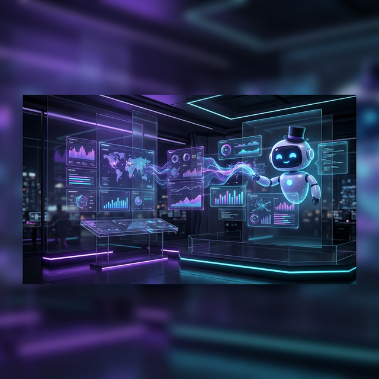

# AI Copilot

Your personal AI assistant that understands your projects, remembers your preferences, and helps you make better decisions.

---

## Streaming Chat

Talk to your agent in natural language. Ask questions about your projects, request reports, or get AI analysis of your team's activity.

The chat interface supports:

- **Real-time streaming** — See responses as they're generated
- **Markdown rendering** — Rich formatting with tables, code blocks, headers
- **Tool call visualization** — Watch the Action Chain as your agent works
- **Context-aware** — Your agent knows which project you're looking at

---

## Agent Memory

AgentOS includes **JP Memory** — an auto-learning system that:

- **Extracts facts** from every conversation (team names, preferences, project details)
- **Remembers corrections** — Tell it once, it remembers forever
- **Injects context** — Relevant memories are automatically included in every reply
- **Fully local** — All memories stored in your SQLite database

Press ++cmd+m++ to view and manage your agent's memory.

---

## Action Chain

When your agent uses tools (GitHub API, Jira, file system), you see the full **Action Chain** in real-time:

- Each tool call shown with its name, arguments, and output
- Per-step timing for performance visibility
- Expandable detail panels
- Full transparency — see exactly what your agent is doing

---

## Command Center

Two-tab interface for maximum productivity:

1. **Quick Commands** — One-click PM prompts: standup, sprint status, risk analysis, blockers
2. **Pipeline Executions** — Automated multi-step tool workflows

Press ++cmd+k++ for the **Command Palette** — spotlight-style search across all commands.

---

## Supported AI Providers

| Provider | Local? | Cost | Setup |
|----------|--------|------|-------|
| **Ollama** | ✅ Yes | Free | [Guide →](../guides/ollama-setup.md) |
| **OpenAI** (GPT-4o) | ❌ Cloud | Paid | API key |
| **Anthropic** (Claude) | ❌ Cloud | Paid | API key |
| **Google Gemini** | ❌ Cloud | Free tier | API key |

!!! tip
    For maximum privacy, use **Ollama**. Everything runs on your machine — no data ever leaves.
