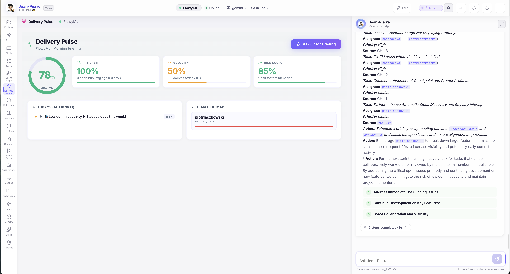

# :material-heart-pulse: Delivery Pulse

**The one question every PM dreads: "Are we going to ship on time?"** Delivery Pulse gives you the answer — in real-time — with velocity trends, milestone tracking, and AI-powered burndown analysis.

[View Jean-Pierre →](../flavors/jean-pierre.md){ .md-button .md-button--primary }
[Download AgentOS :material-download:](https://github.com/UnicoLab/agentos/releases/latest){ .md-button }

---

## The Problem

You find out a project is behind schedule **in the weekly status meeting** — when it's already too late to course-correct. Burndown charts live in Jira where nobody checks them. Velocity trends require manual spreadsheet work. By the time you spot the risk, the deadline has already slipped.

---

## The Solution

Delivery Pulse gives you a **single, always-current view** of project velocity, sprint burndown, and milestone progress. JP proactively alerts you when timelines start slipping — not when they've already slipped.

!!! success "Impact"
    **Deadline surprises drop to zero.** You know exactly where every project stands, every day, without asking anyone.

---

## What You Get

### :material-speedometer: Velocity Tracking
See how fast your team is actually delivering across sprints. Spot slowdowns **weeks before they impact deadlines**.

### :material-flag-checkered: Milestone Progress
Visual progress bars for every milestone and release target. Know instantly what percentage of planned work is complete.

### :material-chart-bell-curve-cumulative: AI Burndown
JP doesn't just show you the burndown — it **predicts where you'll land** based on current velocity and remaining scope.

### :material-bell-alert: Proactive Alerts
When a timeline starts slipping, JP flags it immediately with a clear explanation of why and what to do about it.

---

## Try It

> *"Are we going to hit the Q2 release deadline?"*
>
> → JP analyzes sprint velocity, remaining scope, and milestone progress → delivers a risk-adjusted forecast. **⏱️ ~8 seconds.**

---

[Download AgentOS :material-download:](https://github.com/UnicoLab/agentos/releases/latest){ .md-button .md-button--primary }
[Quick Start Guide :material-rocket-launch:](../getting-started/quick-start.md){ .md-button }

