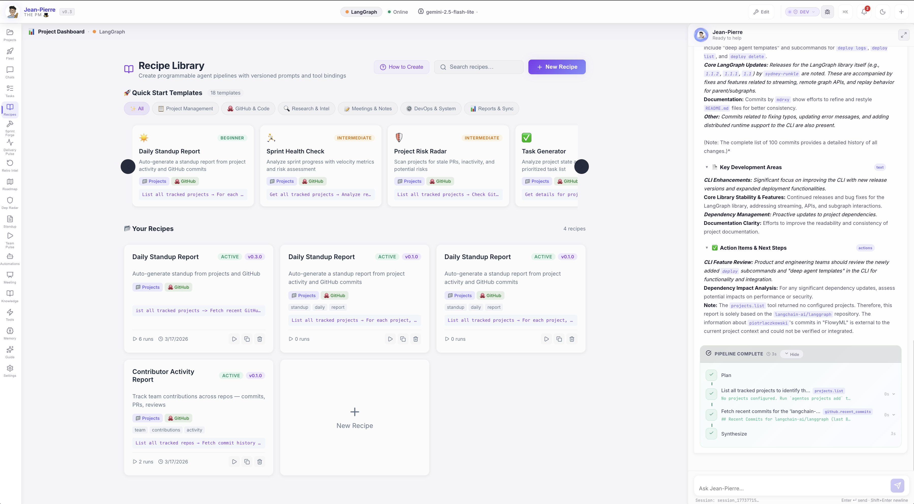
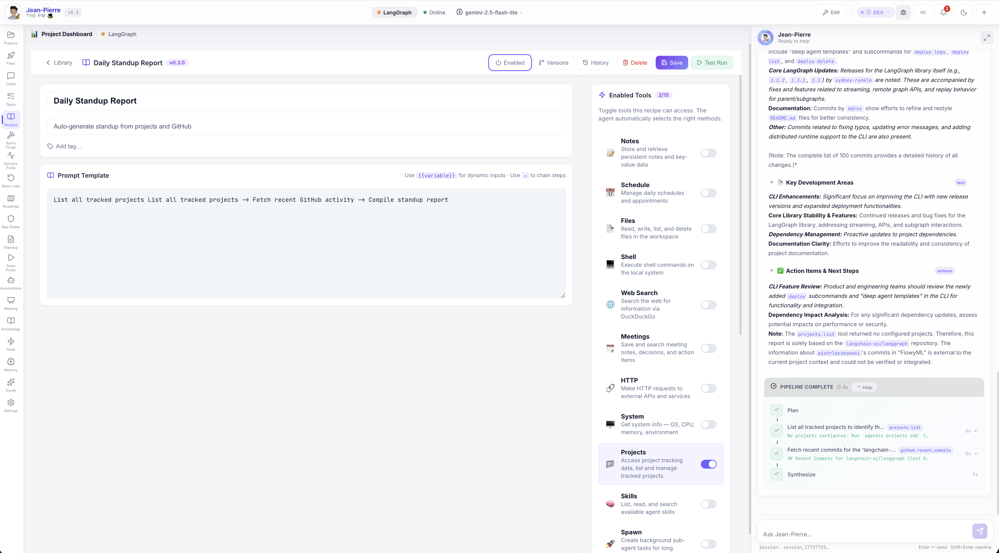

# :material-chef-hat: Recipe Composer

Create programmable agent pipelines with versioned prompts, automatic tool binding, and built-in scheduling — all written in natural language.

[View Jean-Pierre Flavor →](../flavors/jean-pierre.md){ .md-button .md-button--primary }
[Download AgentOS :material-download:](https://github.com/UnicoLab/agentos/releases/latest){ .md-button }

---

## What Are Recipes?

Recipes are **reusable, versioned prompt templates** that define agent workflows. Instead of repeating the same questions, you write a recipe once and run it anytime — on demand or on a schedule.

Think of them as **programmable agent pipelines**:

!!! example "Example Recipes"
    - *"List all tracked projects → Fetch recent commits and open PRs → Compile a structured standup report"*
    - *"Check GitHub for stale PRs → Analyze risk factors → Send digest to Slack"*
    - *"Get all tracked repos → Fetch commit history for the last {{days}} days → Summarize team contributions"*

---

## Recipe Library

Browse, search, and manage all your recipes from one place. Quick Start Templates let you create common workflows in one click.

Each recipe card shows its **version**, **enabled status**, **bound tools**, **tags**, and **run count**. Actions include:

- :material-play: **Quick Run** — Execute instantly via the AI agent chat
- :material-content-copy: **Duplicate** — Clone a recipe as a starting point
- :material-delete: **Delete** — Remove recipes you no longer need
- :material-plus: **New Recipe** — Create from scratch or pick a template

---

## Recipe Composer

Open any recipe to edit its prompt template, bind tools, configure scheduling, and view version history.

### :material-text-box-edit: Prompt Templates
Write agent instructions in natural language. Use `{{variable}}` for dynamic inputs filled at run time, and `→` to chain steps.

### :material-tools: Tool Binding
Toggle which tools the agent can access. Enable **Projects**, **GitHub**, **Tasks**, **Slack**, or any connected integration — the agent auto-selects the right methods.

### :material-source-branch: Version Control
Every save creates an immutable version snapshot with semantic versioning. Restore any previous version with one click — full change history preserved.

### :material-calendar-clock: Scheduling
Run recipes on a schedule — every N minutes or at specific times of day. Filter by day of week. Perfect for daily standups, weekly reports, or periodic audits.

---

## How It Works

1

### Write Your Recipe
Describe your workflow in natural language using the prompt template editor. Use `{{variables}}` for inputs that change each run.

2

### Bind Your Tools
Toggle the tools your recipe needs — GitHub, Projects, Tasks, Slack, and more. The agent automatically selects the right API methods.

3

### Run or Schedule
Click **Test Run** to execute immediately via the AI agent chat, or configure a schedule for automatic execution at the times you choose.

4

### Review Results
Watch the agent execute your recipe in real time — with full tool call visibility, streaming output, and structured results.

---

## Template Syntax

Recipes use a simple, human-readable syntax:

| Syntax | Purpose | Example |
|:-------|:--------|:--------|
| `{{variable}}` | Dynamic input | `Fetch commits for the last {{days}} days` |
| `→` | Chain steps | `List projects → Get PRs → Compile report` |
| Tool names | Agent context | Just mention the tool — the agent figures out the method |

!!! tip "Pro Tips"
    - **No code required** — Write everything in plain English
    - **Reference tools by name** — The agent auto-selects the right methods
    - **Chain with arrows** — Use `→` to define multi-step pipelines
    - **Variables have defaults** — Set fallback values so recipes run without prompting

---

## Quick Start Templates

AgentOS includes **18 ready-to-use templates** across six categories:

| Category | Templates |
|:---------|:----------|
| :material-clipboard-text: **Project Management** | Daily Standup Report, Sprint Health Check |
| :material-source-branch: **GitHub & Code** | Contributor Activity Report, PR Review Digest |
| :material-magnify: **Research & Intel** | Project Risk Radar, Dependency Audit |
| :material-account-group: **Meetings & Notes** | Meeting Action Items, Decision Log |
| :material-cog: **DevOps & System** | System Health Check, Deployment Status |
| :material-chart-bar: **Reports & Sync** | Weekly Executive Summary, Team Velocity Report |

Pick a template, customize it, and save — your recipe is ready to run.

---

## Execution Flow

When you run a recipe (manually or scheduled), here's what happens:

1. **Variable substitution** — `{{variables}}` are replaced with user inputs or defaults
2. **Tool injection** — Bound tools are made available to the agent engine
3. **Agent execution** — The full AI pipeline runs: planning → tool calls → synthesis
4. **Result recording** — Output, duration, and status are saved to run history
5. **Chat display** — Results stream into the JP chat with full tool call visibility

!!! info "Scheduled Runs"
    Scheduled recipes execute automatically through the same agent engine pipeline. Results are recorded in the run history, and the recipe's last-run timestamp is updated.

---

## Version History & Run History

Every recipe maintains full audit trails:

- **Version History** — See every change, compare diffs, restore any version
- **Run History** — View all executions with trigger type (manual/scheduled), duration, status, and output
- **Changelog** — Each version records what changed

---

[Download AgentOS :material-download:](https://github.com/UnicoLab/agentos/releases/latest){ .md-button .md-button--primary }
[Quick Start Guide :material-rocket-launch:](../getting-started/quick-start.md){ .md-button }

