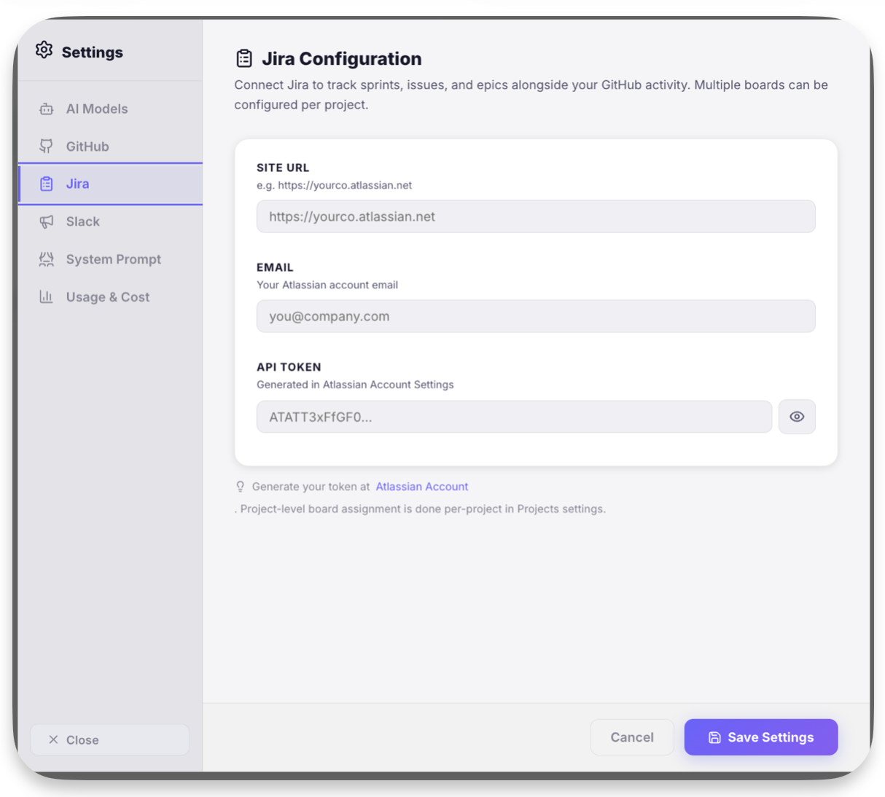

# Jean-Pierre — The PM 🎩

> *"I don't just show you data — I understand your projects."*

Jean-Pierre is the **Project Management flavor** of AgentOS. He's your AI copilot for tracking projects, synthesizing development activity, generating reports, and managing sprints.

---

<h2 style="margin-top: 1rem;">Meet Jean-Pierre</h2>

<em>Your AI Project Management Copilot</em>

---

## What Jean-Pierre Does

### 📊 Project Intelligence
- Connects to your **GitHub repos** and **Jira boards**
- Aggregates data from multiple sources into one unified view
- Calculates **health scores**, **risk assessments**, and **velocity trends**

### 📋 Report Generation
- **Standup reports** — One-click daily status updates
- **Sprint status** — Progress, blockers, and capacity analysis
- **Executive summaries** — Boardroom-ready project overviews
- **Risk analysis** — AI-identified blockers and stale work items

### 🧠 Smart Memory
- Remembers your team structure, project priorities, and preferences
- Learns from every conversation to give better answers over time
- Extracts action items and decisions automatically

### 📅 Meeting Management
- Save, search, and export meeting notes
- Track action items across meetings
- AI-generated follow-up summaries

---

## Quick Actions

Jean-Pierre comes with pre-configured one-click prompts:

| Action | What it does |
|--------|-------------|
| 📊 **List Projects** | Show all tracked projects with repos and Jira keys |
| 📋 **Standup Report** | Generate a structured standup with metrics and risks |
| 🔍 **Sprint Status** | Current sprint progress across all projects |
| 📈 **Project Progress** | Commit activity, sprint metrics, milestones, risks |
| 🏗️ **Sprint Burndown** | Task completion timeline and analysis |
| 📤 **Sync to AIFlow** | Push comprehensive report to AIFlow platform |
| 📝 **New Meeting Note** | Create structured meeting minutes with action items |
| 📋 **Meeting Actions** | Show all open action items from meetings |
| 📖 **Recent Meetings** | List and summarize recent meeting notes |

---

## Screenshots

---

## Configuration Screenshots

---

## Structured Reports

Jean-Pierre generates **rich, structured reports** that render as interactive UI components:

- **:::report** — Standup reports with metrics, risks, and actions
- **:::milestones** — Release timelines and key dates
- **:::gantt** — Sprint task breakdowns and burndown views

---

## Target Audience

- **Engineering Managers** — Track team velocity, PR throughput, sprint health
- **Technical PMs** — Generate reports, identify blockers, coordinate cross-team
- **Freelance Developers** — Manage multiple client projects from one hub
- **Startup CTOs** — Real-time project intelligence without enterprise pricing
