

# Jean-Pierre — The AI PM Copilot 🎩

> "I don't just show you data — I understand your projects."

Jean-Pierre is the **Project Management flavor** of AgentOS — a local-first AI copilot that connects your GitHub, Jira, and documentation into **one real-time, intelligent command center** for every project you manage.

[Download AgentOS :material-download:](https://github.com/UnicoLab/agentos/releases/latest){ .md-button .md-button--primary }
[Quick Start :material-rocket-launch:](../getting-started/quick-start.md){ .md-button }

---

## The Problem

Project managers juggle **5–10 tools daily**. Context-switching between GitHub, Jira, Docs, Slack, and spreadsheets wastes **30% of productive time**. Critical signals get buried in notification noise. No single view tells you: *"How is my project actually doing?"*

---

## The Solution

Jean-Pierre eliminates the noise. He **connects** to your GitHub repos, Jira boards, and team channels — **synthesizes** everything into a premium intelligence dashboard — and **generates** boardroom-ready reports, risk analyses, and sprint plans on the fly. All through natural language. All running **locally on your machine**.

---

## 🤖 AI Chat & Planning

Jean-Pierre's **Living View** puts the AI agent at the center of your project universe. Ask anything in natural language — *"Give me a full status report"* — and watch JP plan, execute tools, and synthesize a structured response in real-time. Quick-action pills (Standup, Status, Blockers, Sprint, Report) let you trigger common workflows with one click.

---

## 📁 Projects

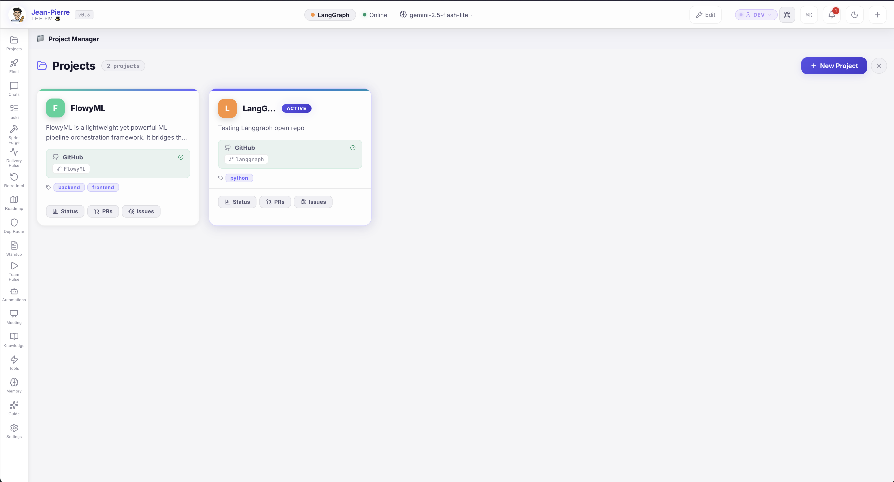

Your **command center starts here**. Each project card shows connected integrations (GitHub, Jira), tech stack tags, and quick-access buttons for Status, PRs, and Issues. Add new projects in seconds and switch between them instantly from the sidebar.

---

## 📊 Command Center Dashboard

The **Classic View** is a premium, 24-card bento-grid dashboard that gives you a complete picture of every project at a glance. Includes Quick JP Analysis prompts, Production Pipelines (Weekly Report, Risk Assessment, Standup, Sprint Planning), Actionable Alerts with AI Auto-Fix, Open PRs list, Commit Activity charts, PR Timeline, and a **Pinned Insights** carousel of past AI analyses. Every card is interactive — click **"Ask JP"** on any widget for instant AI analysis.

### 📈 Velocity Charts
**8-week stacked bar charts** of commits per author. Spot slowdowns and capacity issues instantly.

### 🌡️ Contribution Heatmap
**26-week contribution heatmap** per author — understand commit intensity and engagement patterns at a glance.

### 📅 Smart Gantt
**Auto-generated timelines** derived from real PR activity and sprint data. Interactive filter tabs and proper empty states.

### 🏆 Team Leaderboard
**Gamified contributor ranking** — commit streaks, PR merge rate, and badges (🔥🥇👑). Celebrate your top performers.

### 🗺️ Mind Map
**Visual dependency graph** of Jira issues, epics, and relationships. See the big picture of your project structure.

### 📊 KPI Cards
Open PRs, issues, commits, stars — **dynamic labels** that auto-adapt based on the selected date range.

---

## ✨ Living View

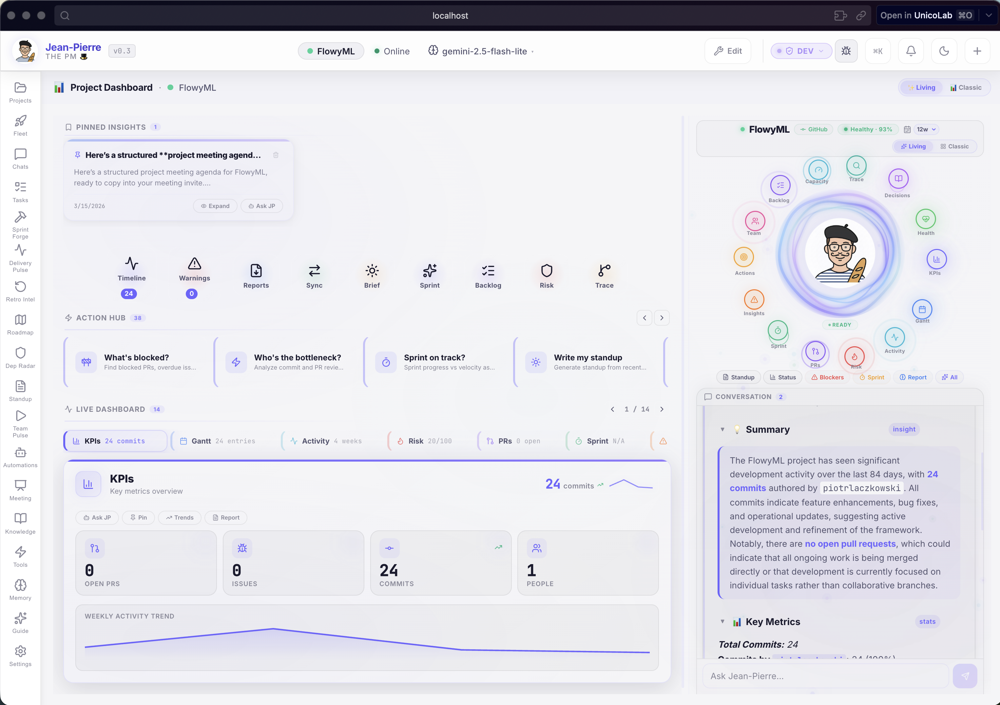

Not a static dashboard — a **living, breathing project surface**. JP's orbital view puts the agent at the center with live metrics orbiting around it: Sprint progress, KPIs, PRs, Risk score, Team, Gantt, Insights, and Actions. A continuously-updated **health score** tells you instantly if your project is on track. Click any orbital node to drill in or ask JP directly.

---

## 🧠 AI Intelligence

### 🎯 Risk Radar
Real-time **0–100 risk score** computed from stale PRs, no-reviewer PRs, low velocity, sprint lag, and open blockers. Spot trouble before it becomes a crisis.

### 🧠 JP Memory
**Autonomous long-term memory.** Jean-Pierre auto-extracts facts, team structures, preferences, and corrections from every conversation. He learns and improves with every interaction.

### 🎯 Action Center
Centralized risks, **AI-generated recommendations**, and a checkable task list with real-time progress tracking. Your cockpit for what to do next.

### 📅 Sprint Planner
JP generates **data-driven sprint plans** from live Jira + GitHub backlog data. Refine tasks interactively, adjust scope — plan smarter, ship faster.

---

## 🔨 Sprint Forge

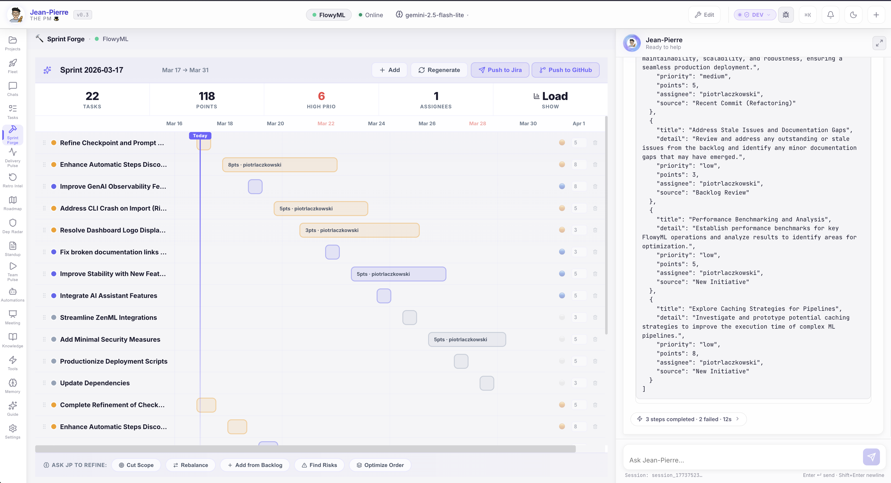

**Plan sprints with AI intelligence.** Sprint Forge pulls live backlog data from Jira and GitHub, analyzes team velocity, and generates optimized sprint plans. Adjust scope, reassign tasks, and refine estimates — all within a single, focused interface. JP suggests task priorities and flags capacity risks before you commit.

---

## 📡 Delivery Pulse

**Track delivery health in real-time.** Delivery Pulse visualizes project velocity, milestone progress, and completion trends across sprints. Spot delivery risks early with AI-powered burndown analysis and proactive alerts when timelines slip. Your single view for answering *"Are we going to ship on time?"*

---

## 🔄 Retro Intelligence

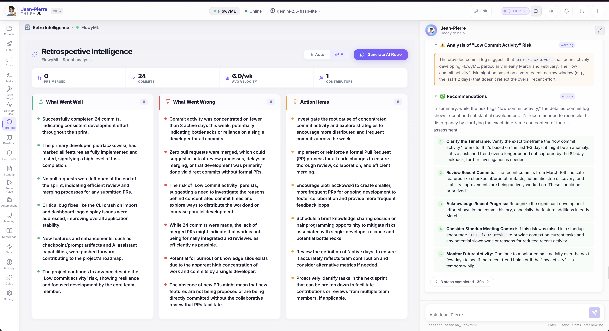

**Retrospectives powered by data, not opinions.** JP analyzes sprint metrics, PR patterns, commit activity, and blockers to generate structured retrospective reports. Get AI-driven insights on what went well, what needs improvement, and concrete action items — all backed by real project data.

---

## 🗺️ Roadmap

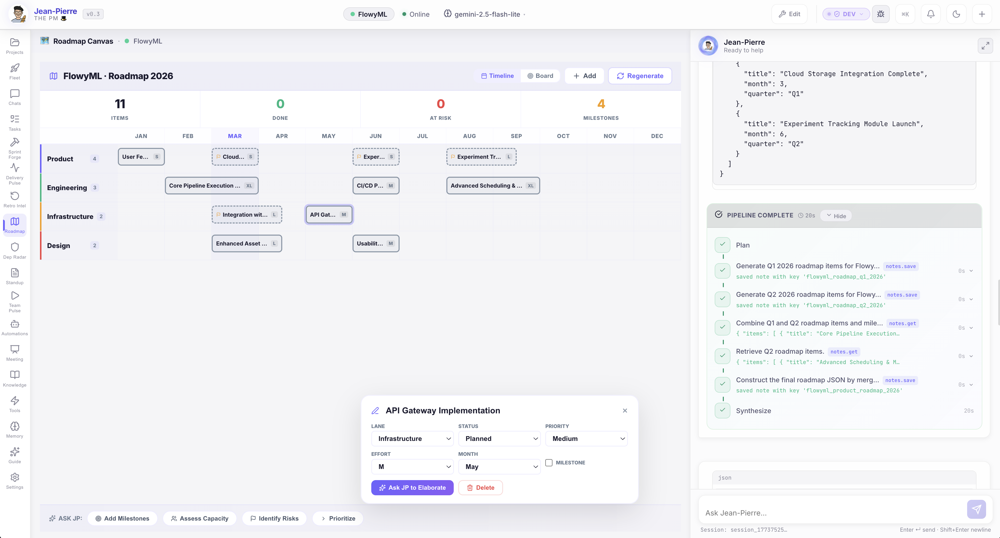

**Visualize your project trajectory.** The Roadmap view displays milestones, release targets, and key deliverables on an interactive timeline. Drag, adjust, and share with stakeholders. JP can auto-generate roadmaps from your sprint data and Jira epics.

---

## 🔗 Dependency Radar

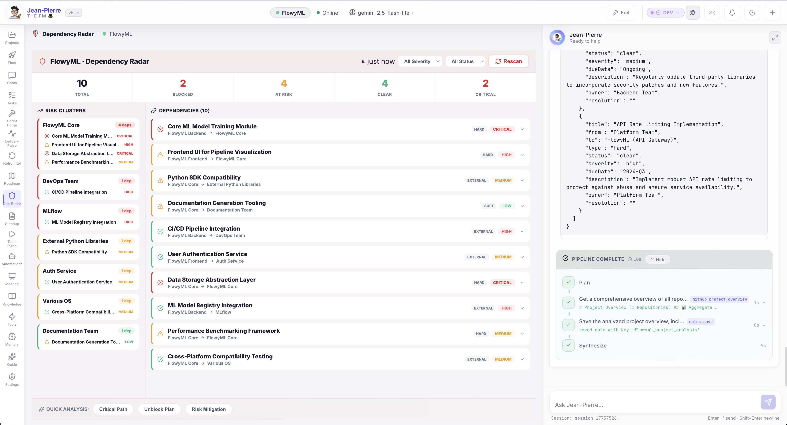

**See what blocks what — before it blocks you.** Dependency Radar creates a visual map of cross-project dependencies, upstream/downstream relationships, and critical-path items. AI highlights high-risk dependency chains and suggests mitigation actions. No more discovering dependency conflicts in standup meetings.

---

## 📋 Standup Scribe

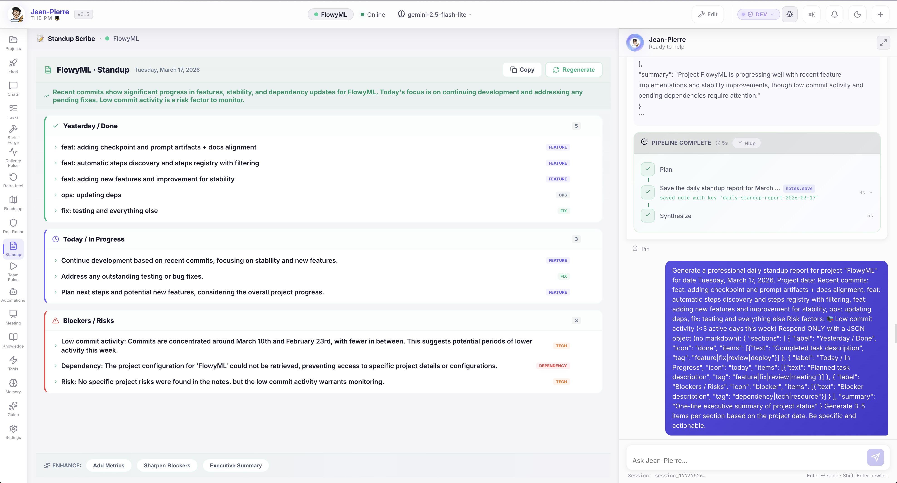

**One-click standups, zero manual effort.** JP generates a professional daily standup from real commit, PR, and sprint data — structured into **Yesterday / Done**, **Today / In Progress**, and **Blockers / Risks** sections. Each item is tagged (FEATURE, FIX, OPS, TECH, DEPENDENCY) and the full report is auto-saved as a project note. Enhance with one-click buttons: Add Metrics, Sharpen Blockers, Executive Summary.

---

## 👥 Team Pulse

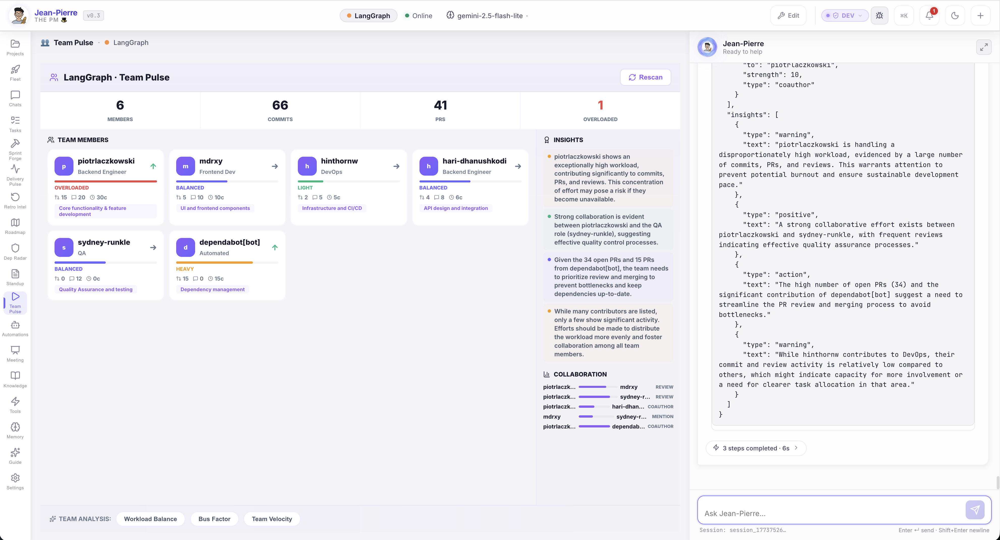

**Understand your team's real capacity.** Team Pulse shows every contributor with their role, workload status (Balanced, Overloaded, Light, Heavy), commit/PR/review counts, and focus area. The **Insights** panel provides AI-generated warnings about burnout risks, collaboration patterns, and actionable recommendations. The **Collaboration** graph visualizes who reviews whom. Quick analysis buttons: Workload Balance, Bus Factor, Team Velocity.

---

## 🛸 Fleet Intelligence

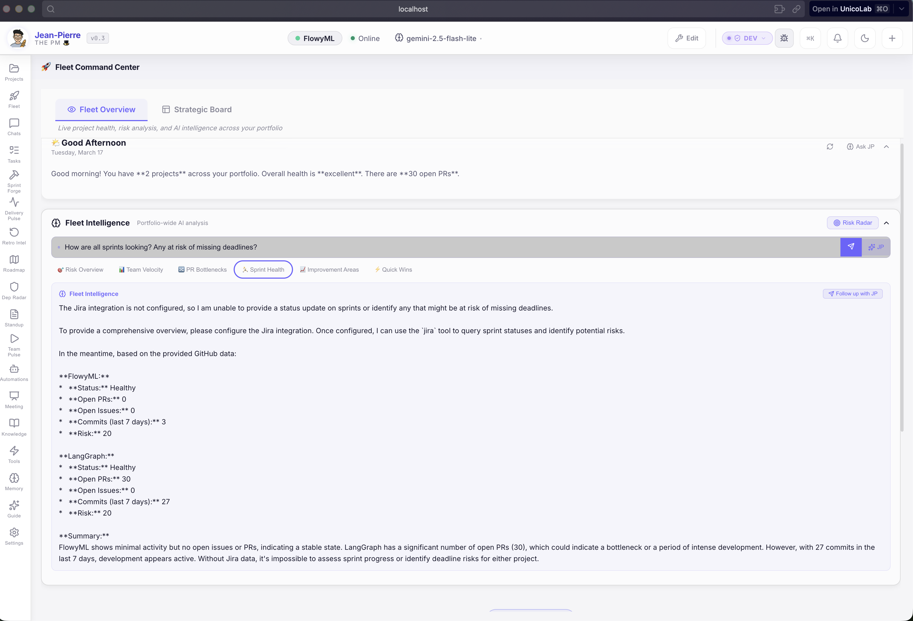

Managing multiple projects? **Fleet Intelligence** gives you a portfolio-wide command center with a daily greeting, overall health summary, and an **AI-powered query bar** for asking cross-project questions. Tabs for Risk Overview, Team Velocity, PR Bottlenecks, Sprint Health, Improvement Areas, and Quick Wins let you drill into any dimension. The **Risk Radar** button triggers a full portfolio risk scan.

---

## 🎯 Strategic Board

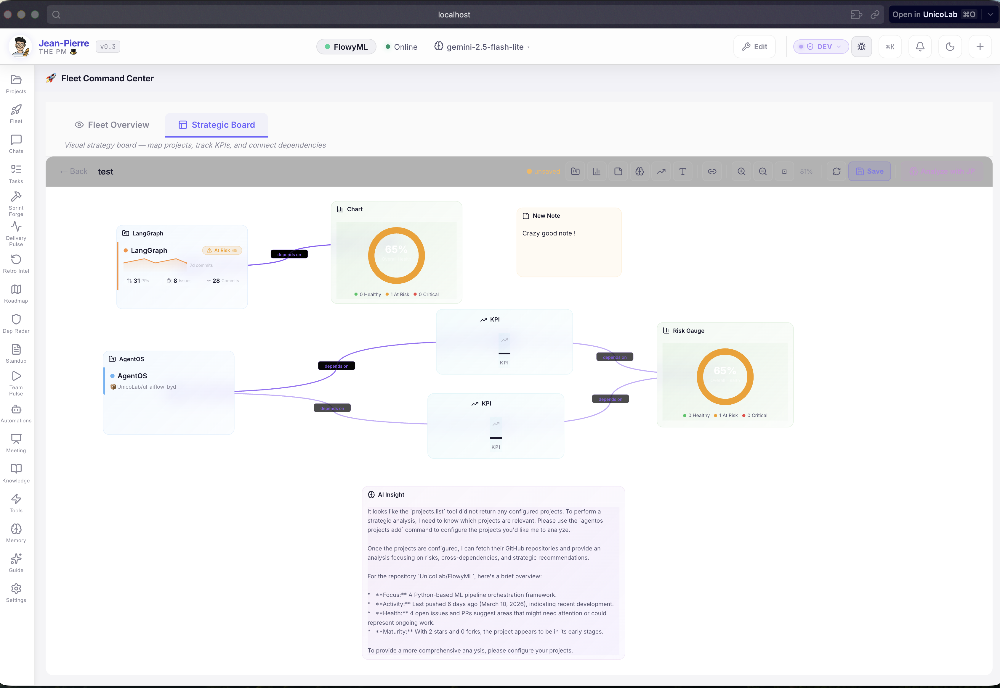

**Your portfolio on a canvas.** The Strategic Board is a free-form visual workspace where you can place project cards, KPI widgets, charts, risk gauges, notes, and dependency links. Map your entire portfolio, track cross-project KPIs, and connect dependencies visually. AI Insight provides strategic analysis of your project landscape. Save multiple boards for different stakeholder views.

---

## ✅ Tasks

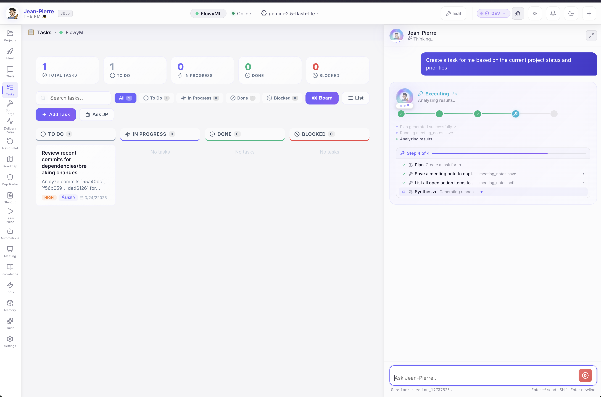

**AI-powered task management.** The Tasks view is a full Kanban board (To Do → In Progress → Done → Blocked) with search, filtering, and status counters. Ask JP to *"Create a task based on the current project status and priorities"* — he'll analyze commits, PRs, and risks, then auto-generate prioritized tasks with descriptions, priority tags, and assignees. The AI execution pipeline is fully visible in the sidebar.

---

## ⚡ Automation Hub

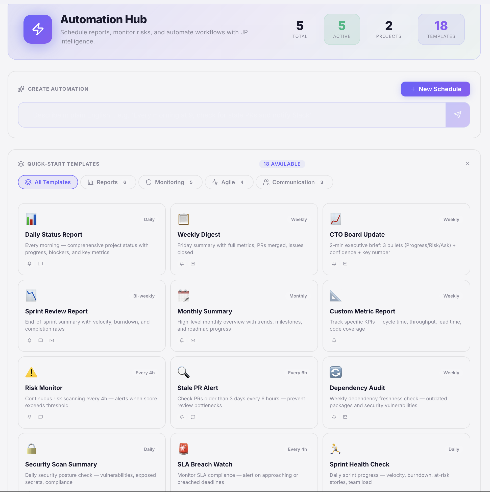

**Put JP on autopilot.** The Automation Hub provides **18 ready-to-use templates** across four categories: **Reports** (Daily Status, Weekly Digest, CTO Board Update, Sprint Review, Monthly Summary, Custom Metrics), **Monitoring** (Risk Monitor, Stale PR Alert, Dependency Audit, Security Scan, SLA Breach Watch), **Agile** (Sprint Health Check, Sprint Review, Dependency Audit, Sprint Health Check), and **Communication** (Slack Standup, Team Digest, Stakeholder Update). Create custom schedules with natural language or use the + New Schedule button. Each automation runs on your configured cadence — daily, weekly, bi-weekly, or custom intervals.

---

## 🐙 Integrations

🐙

### GitHub
Multi-repo: PRs, commits, issues, contributor activity, webhooks — **aggregate across all repos** into one view.
[Setup Guide →](../guides/github-setup.md)

📋

### Jira
Multi-board: sprint status, issue tracking, backlog management — **aggregated across all configured boards**.
[Setup Guide →](../guides/jira-setup.md)

💬

### Slack
One-click standup reports **posted directly to any Slack channel** via webhook. Keep your team in the loop without lifting a finger.
[Setup Guide →](../guides/slack-setup.md)

🔄

### AIFlow Sync
Connect to **AIFlow** for centralized intelligence, advanced analytics, and multi-agent orchestration across your organization.
[Learn More →](../guides/aiflow-sync.md)

---

## ⚡ Productivity Arsenal

### ⌘K Command Palette
**Spotlight-style search** across all commands. Navigate, trigger actions, ask AI — all from a single keyboard shortcut.

### 💡 Quick Prompts
**6 one-click PM prompt pills** — blockers, bottlenecks, sprint health, standup report, risk analysis, and more. Instant answers.

### 📝 Meeting Notes
**AI-generated meeting minutes** with structured action item tracking, searchable meeting history, and follow-up management.

### 📰 Daily Brief
**Automated 9AM project summaries** — or generate on demand. Every morning starts with a clear picture of the day.

### 📄 PDF Export
**Export any dashboard to PDF** — pixel-perfect reports ready for stakeholder meetings and executive reviews.

### 📝 Project Notes
**Auto-saving markdown scratchpad** per project. Persisted locally, always available. Your project's living notebook.

---

## ⛓️ Action Chain — Full Transparency

Watch exactly how Jean-Pierre works. Every tool call is visualized as an **expanding chain** with:

- 🔧 **Tool arguments** displayed as formatted JSON
- 📤 **Full output** from each step
- ⏱️ **Per-step timing** so you can see how long each operation took

No black boxes. Complete transparency into every AI decision.

---

## Quick Actions

Jean-Pierre comes with pre-configured **one-click workflows** tailored for Project Managers:

| Action | What it does |
|--------|-------------|
| 📊 **List Projects** | Show all tracked projects with repos and Jira keys |
| 📋 **Standup Report** | Generate a structured standup with metrics and risks |
| 🔍 **Sprint Status** | Current sprint progress across all projects |
| 📈 **Project Progress** | Commit activity, sprint metrics, milestones, risks |
| 🏗️ **Sprint Burndown** | Task completion timeline and analysis |
| 📅 **Sprint Planner** | AI-generated sprint plans from live backlog data |
| 🎯 **Action Center** | Centralized risks and AI-recommended next steps |
| 📤 **Sync to AIFlow** | Push comprehensive report to AIFlow platform |
| 📝 **New Meeting Note** | Create structured meeting minutes with action items |
| 📋 **Meeting Actions** | Show all open action items from meetings |
| 💬 **Slack Standup** | Post standup report to Slack channel |
| 📰 **Daily Brief** | Generate automated project summary |

---

## 🏗️ Structured Intelligence

Jean-Pierre doesn't just output text. He generates **interactive, data-rich components** from your live project data:

- **:::report** — Deep-dive standups with velocity metrics and risk breakdown
- **:::milestones** — Visual release timelines and key tracking dates
- **:::gantt** — Live sprint task breakdowns and burndown analysis

---

## 🔒 Private by Design

Jean-Pierre runs **entirely on your machine**. Conversations, project data, meeting notes, and memories — everything stays local in an encrypted SQLite database. No cloud storage, no third-party analytics. **Your project intelligence is yours alone.**

[Learn more about our security model →](../security.md)

---

## Who is it for?

### 👨‍💼 Engineering Managers
Real-time team velocity, PR throughput, contribution heatmaps, and risk radar for every project in your portfolio.

### 📋 Technical PMs
Automated reporting, sprint planning, cross-team coordination, and boardroom-ready executive summaries in seconds.

### 💻 Freelance Developers
Manage multiple client project hubs with ease. Fleet View keeps every project at your fingertips.

### 🚀 Startup CTOs
Enterprise-grade project intelligence on your local machine — without the enterprise price tag.

---

[Download AgentOS :material-download:](https://github.com/UnicoLab/agentos/releases/latest){ .md-button .md-button--primary }
[Request Invite :material-email:](mailto:info@unicolab.ai){ .md-button }

