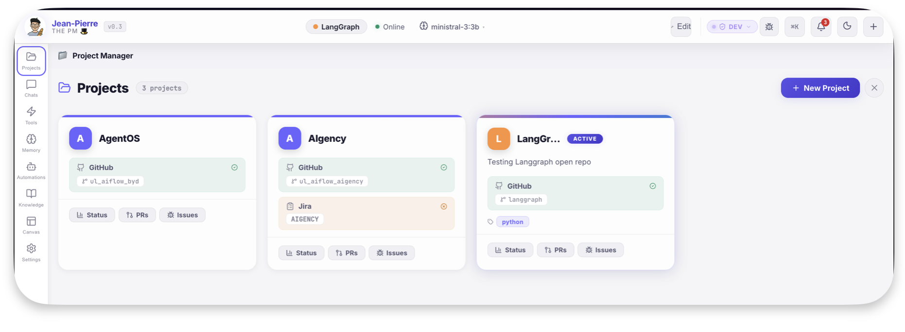
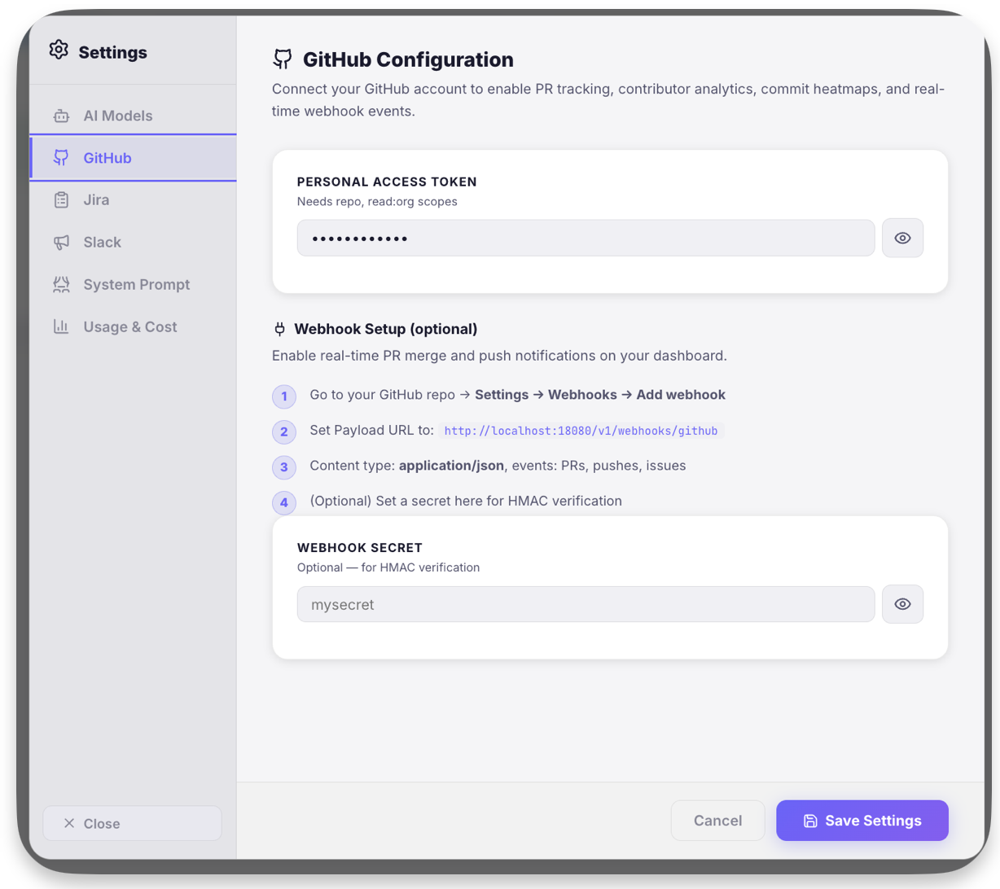

# Jean-Pierre — The AI PM Copilot 🎩

> "I don't just show you data — I understand your projects."

Jean-Pierre is the **Project Management flavor** of AgentOS. He's your AI copilot for tracking projects, synthesizing development activity, generating reports, and managing sprints.

[Request Invite :material-email:](mailto:info@unicolab.ai){ .md-button .md-button--primary }
[View Quick Start :material-rocket-launch:](../getting-started/quick-start.md){ .md-button }

---

## What Jean-Pierre Does

### 📊 Project Intelligence
Connects to your **GitHub repos** and **Jira boards** to aggregate data into one unified, AI-enriched view.

### 📋 Report Generation
One-click standups, sprint status, and executive summaries. Boardroom-ready project overviews in seconds.

### 🧠 Smart Memory
Remembers team structure, priorities, and preferences. Learns from every conversation to give better answers.

### 📅 Meeting Management
AI-generated minutes, action item tracking, and searchable meeting history across all your projects.

---

## Quick Actions

Jean-Pierre comes with pre-configured one-click prompts tailored for Project Managers:

| Action | What it does |
|--------|-------------|
| 📊 **List Projects** | Show all tracked projects with repos and Jira keys |
| 📋 **Standup Report** | Generate a structured standup with metrics and risks |
| 🔍 **Sprint Status** | Current sprint progress across all projects |
| 📈 **Project Progress** | Commit activity, sprint metrics, milestones, risks |
| 🏗️ **Sprint Burndown** | Task completion timeline and analysis |
| 📤 **Sync to AIFlow** | Push comprehensive report to AIFlow platform |
| 📝 **New Meeting Note** | Create structured meeting minutes with action items |
| 📋 **Meeting Actions** | Show all open action items from meetings |

---

## Screenshots

---

## Configuration

*AI Provider Setup*

*Source Control Sync*

*Sprint Tracking*

---

## 🏗️ Structured Intelligence

Jean-Pierre doesn't just output text. He generates **interactive components** based on your project data:

- **:::report** — Deep dive standups with velocity metrics
- **:::milestones** — Visual release timelines and key tracking dates
- **:::gantt** — Live sprint task breakdowns and burndown analysis

---

## Who is it for?

- **Engineering Managers** — Real-time team velocity and PR throughput
- **Technical PMs** — Automated reporting and cross-team coordination
- **Freelance Developers** — Manage multiple client project hubs with ease
- **Startup CTOs** — Enterprise-grade project intelligence on your local machine
