

# Michelle — Analytics Intelligence 📊

> "I don't guess — I show you the data, the source, and the reasoning."

Michelle is the **Analytics Intelligence flavour** of AgentOS — built on the same [modular platform](index.md) that powers Jean-Pierre. She connects to your databases, learns your schema, metrics, and business rules, then lets anyone on your team ask questions in plain English — and get **verified, source-attributed answers** in seconds.

[Download AgentOS :material-download:](https://github.com/UnicoLab/agentos/releases/latest){ .md-button .md-button--primary }
[Quick Start :material-rocket-launch:](../getting-started/quick-start.md){ .md-button }

!!! info "One of Many Possible Flavours"
    Michelle proves what the AgentOS platform can do for **Analytics & Business Intelligence**. The same modular architecture — engine, tool packs, dashboard widgets, AI persona — can be configured for any domain. [Learn about the platform →](index.md)

---

## The Problem

Data teams are drowning. Business users need answers **now**, but between writing SQL, building dashboards, and explaining what the numbers actually mean — analysts spend **70% of their time** on repetitive data plumbing instead of strategic analysis.

| Pain Point | Impact |
|-----------|--------|
| Business users can't self-serve data | Analysts become bottlenecks — ticket queues grow |
| SQL queries are written from scratch every time | Hours wasted recreating the same logic |
| Dashboards go stale within weeks | Decisions made on outdated information |
| AI chatbots hallucinate metrics | Wrong numbers → wrong decisions → lost revenue |
| No institutional knowledge capture | When analysts leave, their knowledge leaves too |

---

## The Solution

Michelle **eliminates the analytics bottleneck**. She connects directly to your databases, learns your schema and business rules, and lets anyone — from the CEO to a junior PM — ask data questions in plain English. Every answer comes with the **actual SQL**, the **source tables**, and **provenance tracking** so you can verify exactly how any number was calculated.

No hallucinations. No black boxes. No data leaving your machine.

---

## 🎯 Real-World Scenarios

!!! example "\"What\'s our MRR?\" — CEO Asks at 3pm"
    Without Michelle: 2-hour ticket filed with the data team. Analyst writes SQL, sends a spreadsheet. CEO doesn't trust the number.

    **With Michelle:** CEO types *"What's our MRR by segment?"* → 3 seconds later: table with exact SQL, source tables, and provenance badge. **Verified. Trusted. Done.**

!!! example "Best Analyst Just Quit"
    Without Michelle: 3 weeks of onboarding. New analyst re-discovers metric definitions, query patterns, business context.

    **With Michelle:** Everything is in the Shared Brain — definitions, rules, examples, corrections. New analyst asks *"How do we calculate churn?"* → instant, governed answer from **accumulated team intelligence**.

!!! example "Board Deck Needs Numbers — Nobody Trusts the AI"
    Without Michelle: Team goes back to manual SQL to be safe. 4 hours of double-checking.

    **With Michelle:** Test Harness validates every key metric against known answers. Provenance badges prove the data path. **Board trusts the numbers because they can verify them.**

~15 hrs/week freed per data team

€63,750 in annual productivity gains

Plus: 95% accuracy by day 14 · zero hallucinations · knowledge survives turnover

---

## 📊 Analytics Living Dashboard

Not a static BI tool — a **living analytics command center**. Michelle's dashboard shows your KPIs in real-time, with AI-powered insights that surface anomalies, trends, and recommendations automatically. Drag, rearrange, and customize — every widget updates live.

---

## 💬 Ask Anything in Plain English

Just ask:

> *"What were our top 10 products by revenue last quarter?"*
>
> → Michelle writes the SQL, executes it, and returns a formatted table with totals — **⏱️ 3 seconds.**

> *"Which customers haven't purchased in 90 days?"*
>
> → Michelle queries your customer and order tables, identifies at-risk accounts, and suggests follow-up actions. **⏱️ 4 seconds.**

> *"Compare this month's sales to the same period last year."*
>
> → Michelle generates year-over-year comparison with percentage changes and trend visualization. **⏱️ 5 seconds.**

Every answer includes the **exact SQL query** used, so analysts can verify, refine, and learn.

---

## 📈 KPI Dashboard — Your Metrics at a Glance

Define your key business metrics once — Michelle tracks them continuously. She detects anomalies, compares against targets, and alerts you when something needs attention. No more manually refreshing spreadsheets.

---

## 🧠 Collective Intelligence — Shared Brain

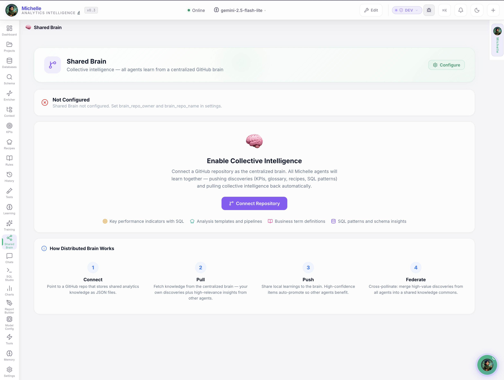

When one analyst teaches Michelle a metric definition, **everyone benefits**. The Shared Brain is a centralized knowledge repository where business rules, metric definitions, and domain expertise are stored, versioned, and governed — with PR-based approval workflows.

- **Metric definitions** — "Revenue = sum of order totals excluding returns"
- **Business rules** — "Active customer = purchased within 90 days"
- **Domain glossary** — "SKU", "AOV", "LTV" with your company's exact definitions
- **Approved examples** — Verified question→SQL pairs that teach Michelle your patterns

---

## 🔍 Context Explorer — Business Rules Engine

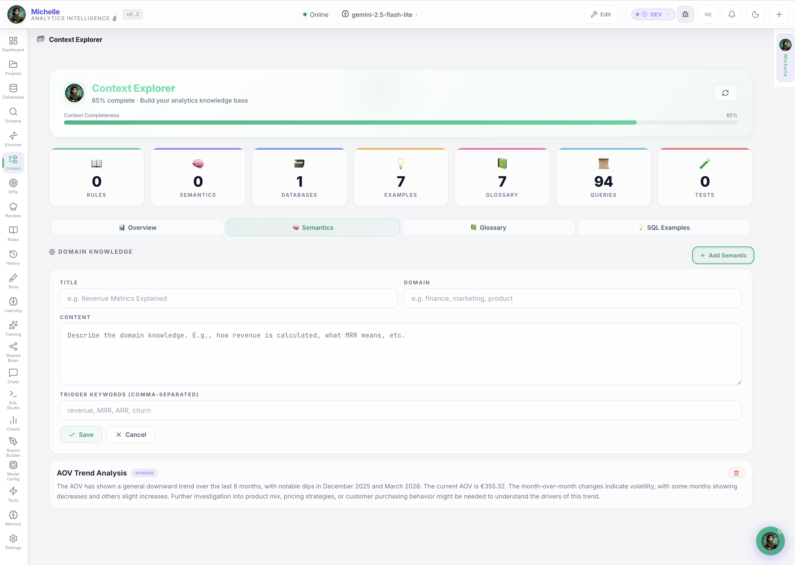

The Context Explorer is where you define the **rules of your data universe**. Business glossary terms, metric formulas, table relationships, and domain-specific constraints — all organized, searchable, and automatically injected into every AI response. This is how Michelle **avoids hallucinations**: she knows your exact definitions.

---

## 🗄️ Database Management — Connect Everything

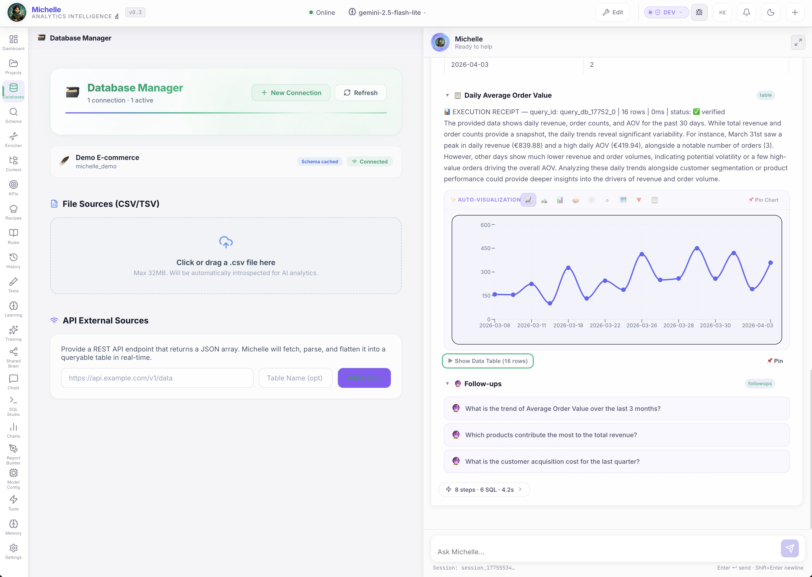

Connect PostgreSQL, MySQL, SQLite, or any SQL-compatible database. Michelle discovers schemas automatically, indexes relationships, and maintains live metadata — so she always knows your data landscape.

---

## 🧬 Evolutionary Memory — Self-Healing Knowledge

Every correction you make — "No, revenue should exclude tax" — Michelle **remembers forever**. Her evolutionary memory tracks corrections, learns preferences, and continuously improves answer quality. She gets smarter with every interaction, never repeating the same mistake twice.

---

## ⚙️ Metadata Engineering — Schema Enrichment

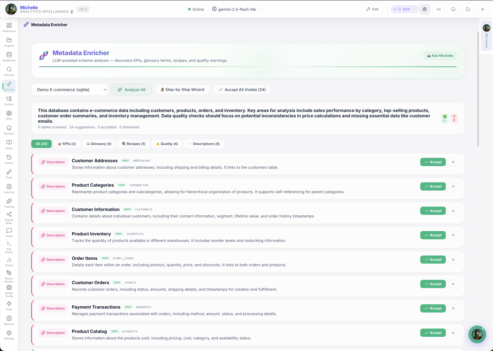

Enrich your database metadata with human-readable descriptions, business context, and relationship annotations. This metadata powers Michelle's understanding — the richer your annotations, the more accurate her responses.

---

## 🤖 Model Optimization — AI Provider Routing

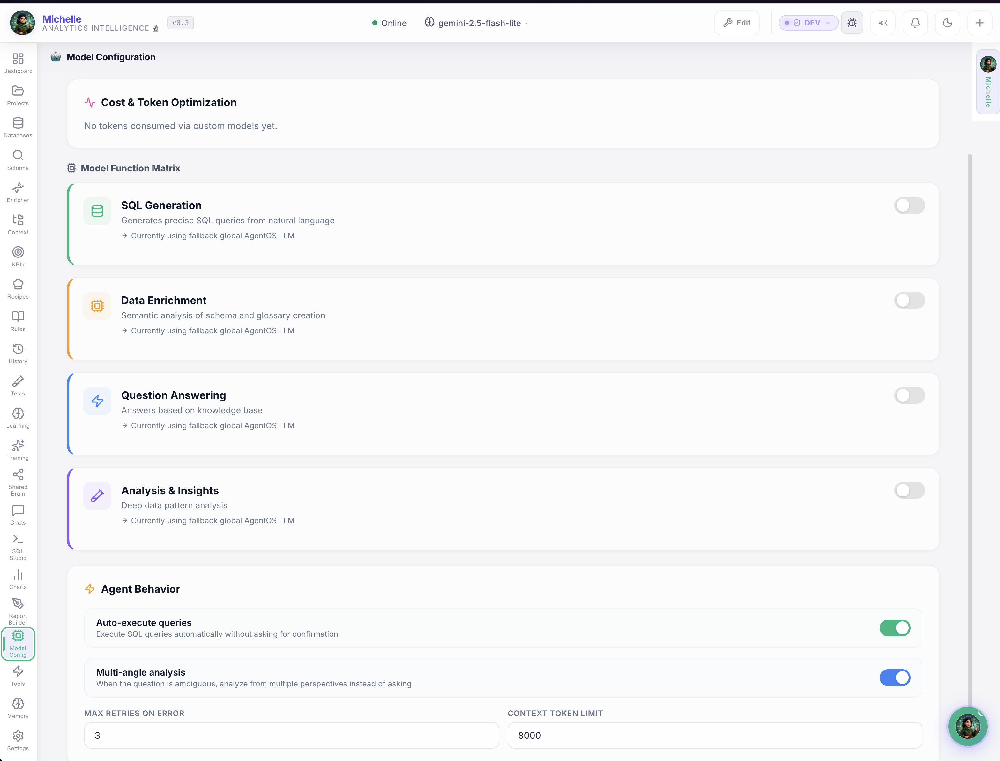

Route different tasks to different AI models for optimal cost and quality. SQL generation → high-precision model. Simple lookups → fast, cheap model. Analysis → reasoning-optimized model. Full control over which brain handles which question.

---

## 📜 Query History — Full Audit Trail

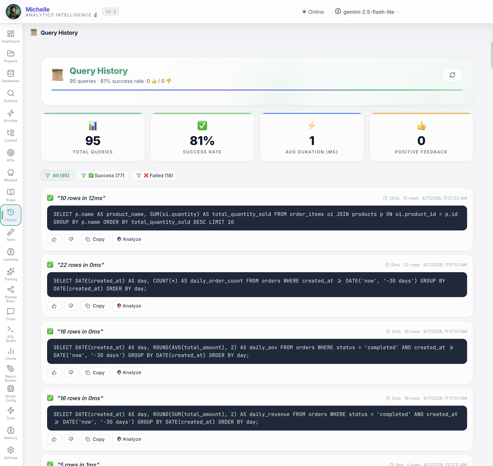

Every question, every SQL query, every result — logged with timestamps, user, and provenance. Perfect for compliance, debugging, and understanding how your data is being used across the organization.

---

## 📋 Recipes — Pre-Built Analysis Pipelines

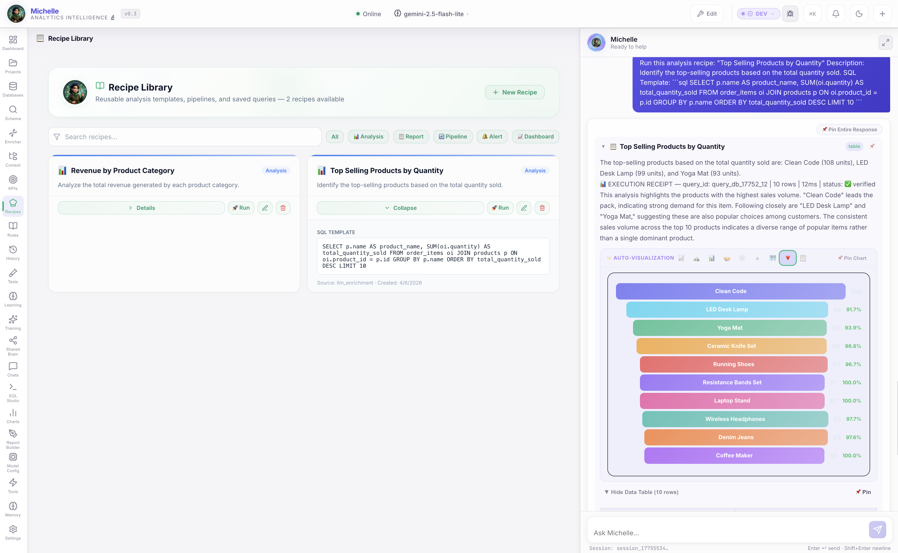

Build reusable analysis workflows — "Monthly Revenue Report", "Customer Churn Analysis", "Inventory Health Check" — and schedule them to run automatically. Michelle executes multi-step analytical pipelines and delivers formatted results on your schedule.

---

## 📄 Report Builder — Professional Reports

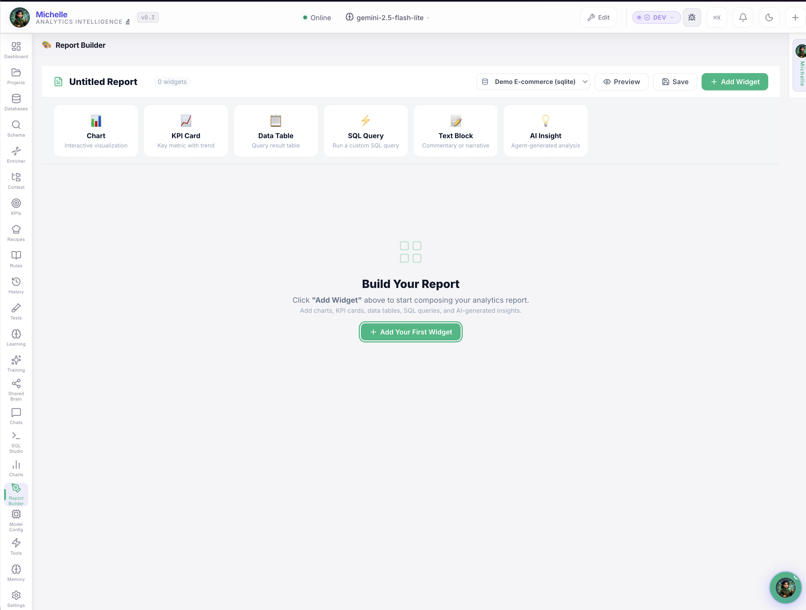

Generate boardroom-ready analytics reports with one click. Charts, tables, insights, and recommendations — formatted professionally and ready to share with stakeholders.

---

## 📏 Rules Editor — Business Rule Governance

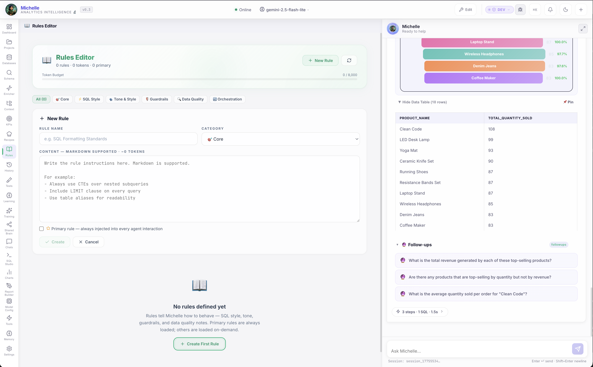

Define validation rules that Michelle follows when generating queries. "Never include cancelled orders in revenue." "Always filter by tenant_id." "Use fiscal year, not calendar year." These rules are **enforced automatically** — preventing subtle data errors.

---

## 🗂️ Schema Browser — Visual Database Explorer

Explore your database visually — tables, columns, types, relationships, and row counts at a glance. Annotate columns with business descriptions that feed directly into Michelle's understanding.

---

## 💻 SQL Studio — Full SQL IDE

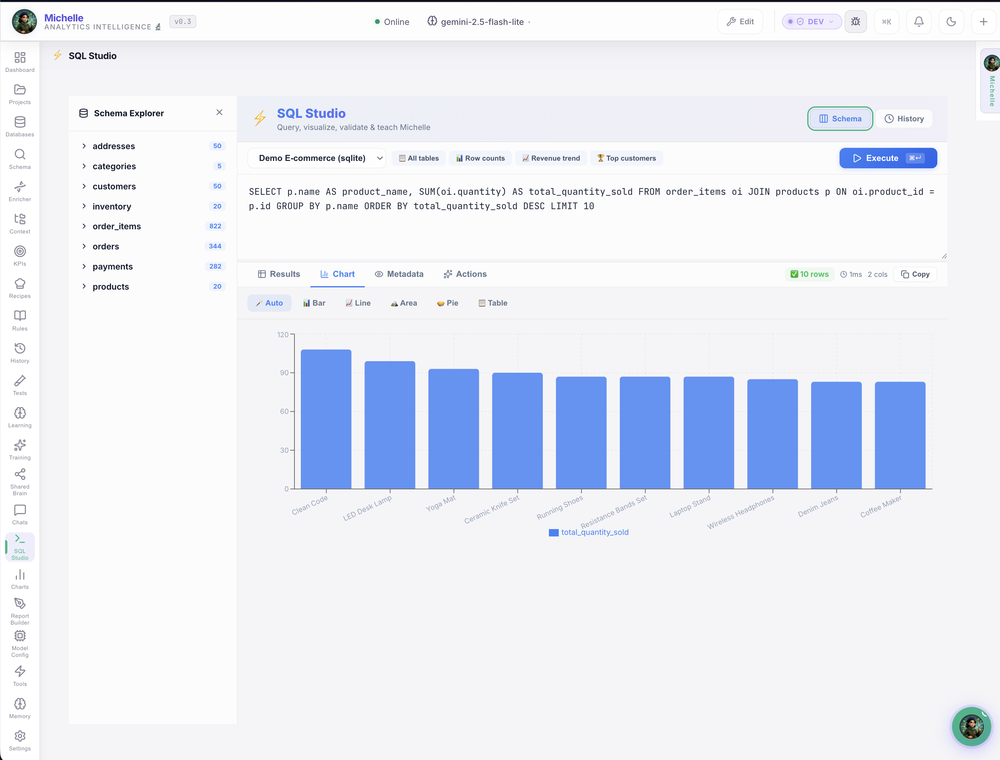

For power users who want to write their own SQL — a built-in IDE with syntax highlighting, auto-completion, and AI-assisted query refinement. Write, test, and save queries — then share them as team recipes.

---

## 🧪 Test Harness — Validate AI Answers

Don't trust — **verify**. The Test Harness lets you define expected answers for known questions and run automated validation suites against Michelle's outputs. Catch regressions, measure accuracy, and build confidence before rolling out to business users.

---

## 🎓 Training Pipeline — Teach Your Domain

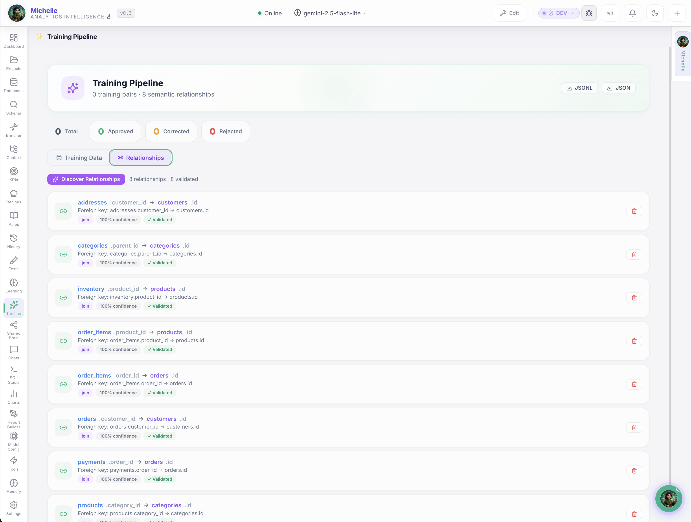

Feed Michelle curated question→SQL pairs, business rules, and domain glossary entries. The Training Pipeline ingests, validates, and integrates this knowledge — turning a general-purpose AI into a **domain specialist** that speaks your company's language.

---

## ✨ Why You Can Trust Michelle

<strong>Self-service analytics you can trust.</strong> Not because we say so — because we engineered an entire ecosystem to make it provably true.

Most AI analytics tools generate SQL and hope for the best. Michelle is different: she was architected from the ground up to ensure that **every number that comes out is transparent, auditable, and continuously improving**. Here's how:

### :material-shield-check: Transparent by Design
Every answer shows the **exact SQL**, the source tables, and clickable `[source:N]` provenance badges. You don't trust a black box — you **verify** the data path. If something can't be verified, it's flagged UNVERIFIED — never presented as fact.

### :material-brain: Self-Reflection & Memory
Michelle doesn't just answer — she **reflects on her own outputs**. Evolutionary Memory across 6 namespaces (errors, corrections, tool wisdom, user adaptation, performance, knowledge) means she learns from every interaction. Same question, better answer next week — tracked and verifiable.

### :material-account-group: Federated Knowledge & Governance
The **Shared Brain** captures metric definitions, business rules, and validated SQL patterns — versioned in Git with PR-based review. When one analyst teaches Michelle "Revenue = orders minus returns," **everyone gets it right**. Knowledge survives vacations, promotions, and resignations.

### :material-chart-box: Everything Integrated
Charts (9 types), interactive dashboards, KPI gauges with thresholds, anomaly detection, sparklines, drill-downs, pinned insights, follow-up suggestions, and scheduled reports — all **built in**. No switching between tools. From question to chart to board deck in one flow.

### :material-auto-fix: Auto-Correction & Anomaly Detection
Correct a result once → Michelle **never makes the same mistake again**. The KPI engine runs on cron, detects anomalies against historical baselines, and alerts you **before** wrong numbers reach a stakeholder. Test Harness validates accuracy against known answers before deployment.

### :material-book-open-page-variant: Context-Careful Crafting
Business glossary, domain jargon, table relationships, column semantics — all injected **architecturally into every prompt**. Michelle doesn't guess what "active customer" means. She **knows** because you defined it, and it's enforced on every query, every time.

!!! quote "The Bottom Line"
    Other AI tools generate SQL. Michelle generates SQL, **validates it**, shows you the proof, learns from corrections, shares knowledge across your team, and gets measurably more accurate every day. That's not a feature list — that's an **engineered trust system**.

---

## :material-scale-balance: The ROI

| Metric | Before Michelle | With Michelle | Savings |
|--------|----------------|---------------|---------|
| Ad-hoc data requests | 2-4 hrs each (SQL + context) | 10 seconds (plain English) | **95% faster** |
| Dashboard creation | Days of development | Minutes of configuration | **10x faster** |
| Analyst onboarding | Weeks to learn the schema | Instant (Michelle knows it) | **Weeks saved** |
| Data quality errors | Discovered in reports (too late) | Caught with Test Harness | **Fewer mistakes** |
| Knowledge retention | Lost when analysts leave | Captured in Shared Brain | **Permanent** |
| **Total time saved** | | | **~15 hrs/week per team** |

!!! tip "That's 750+ hours per year per analytics team"
    At €85/hour for analyst time, that's **€63,750 in annual productivity gains** per team — plus the value of better, faster decisions.

---

## :material-shield-check: 9 Layers of Anti-Hallucination

Text-to-SQL tools generate queries. Michelle generates queries, **validates them**, learns from corrections, shares knowledge across your team, and gets measurably more accurate every day.

🧠

Triage

Can it be answered from context?

→

⚡

Generate

SQL with full schema context

→

▶️

Execute

Run with provenance tracking

→

📈

Learn

Record into evolution memory

<strong>Adaptive Schema</strong> — Tiered injection handles 100+ tables

<strong>Business Glossary</strong> — Your definitions, injected per prompt

<strong>Business Rules</strong> — "Exclude deleted" enforced architecturally

<strong>Validated Examples</strong> — Approved NL→SQL as few-shot training

<strong>Evolution Memory</strong> — 6 namespaces that persist across sessions

<strong>Semantic Joins</strong> — LLM-assisted FK discovery beyond constraints

<strong>Provenance Tags</strong> — Clickable [source:N] citations on every answer

<strong>Test Harness</strong> — Validate accuracy before deploying to team

<strong>Multi-Model Routing</strong> — Right model per task: SQL, Q&A, enrichment

---

## Who Is It For?

### 📊 Data Analysts
Stop writing the same SQL queries over and over. Michelle handles the repetitive plumbing — you focus on the strategic insights.

### 📈 BI Managers
Unify metric definitions across the team. Michelle's Shared Brain ensures everyone is using the same formulas, the same filters, the same business logic.

### 👔 Product Managers
Get data answers in seconds, not days. No more filing tickets with the data team for simple questions. Self-serve with confidence.

### 🏢 Executives
Boardroom-ready reports and KPI dashboards that update automatically. Ask strategic questions in plain English and get answers backed by real data.

---

[Download AgentOS :material-download:](https://github.com/UnicoLab/agentos/releases/latest){ .md-button .md-button--primary }
[Apply as Founding Member :material-email:](mailto:info@unicolab.ai?subject=Founding%20Member%20-%20Michelle){ .md-button }

