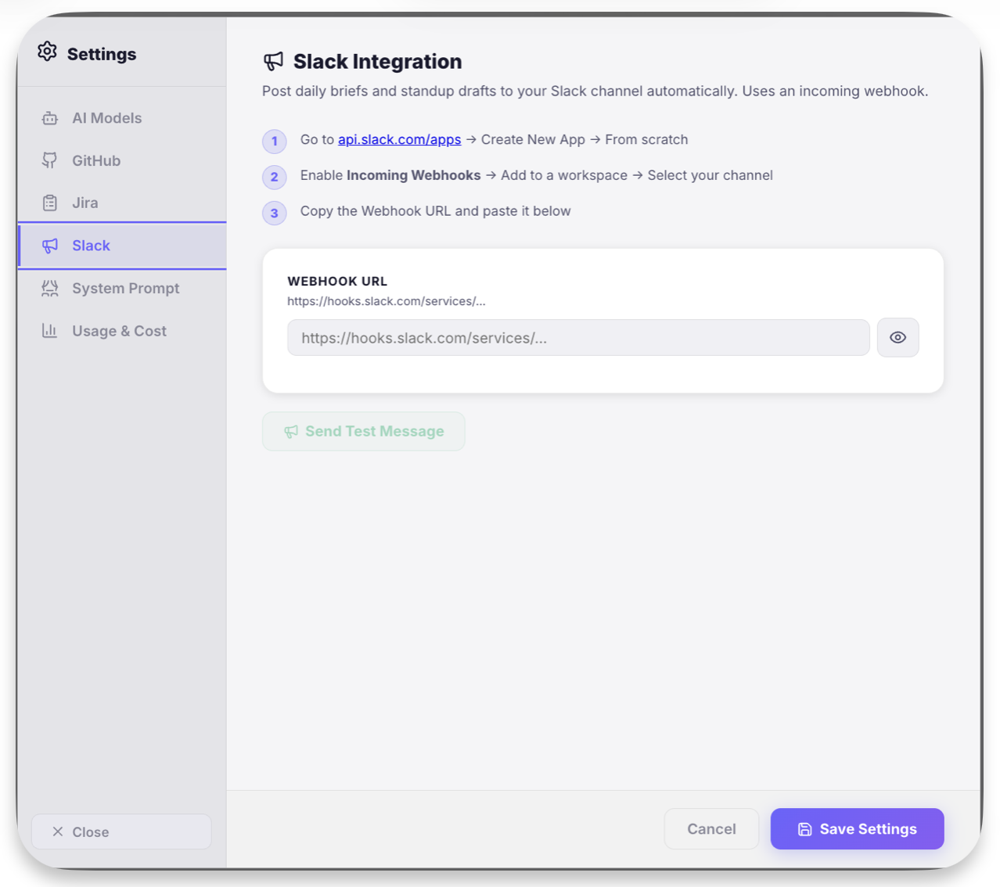

# Slack Setup

Send standup reports and notifications directly to your Slack channels.

---

## Create a Webhook

1. Go to [api.slack.com/apps](https://api.slack.com/apps)
2. Click **Create New App** → **From scratch**
3. Name it "AgentOS" and select your workspace
4. Go to **Incoming Webhooks** → Toggle **On**
5. Click **Add New Webhook to Workspace**
6. Select the channel (e.g., `#standups`)
7. **Copy the Webhook URL**

---

## Configure

Add to Settings or `~/.agentos/config.yaml`:

```yaml
slack_webhook_url: https://hooks.slack.com/services/T.../B.../...
```

<div class="screenshot">

</div>

---

## Usage

Ask your agent: *"Send a standup report to Slack for My Project"*

Or use the **Send to Slack** button in the Standup Composer.
