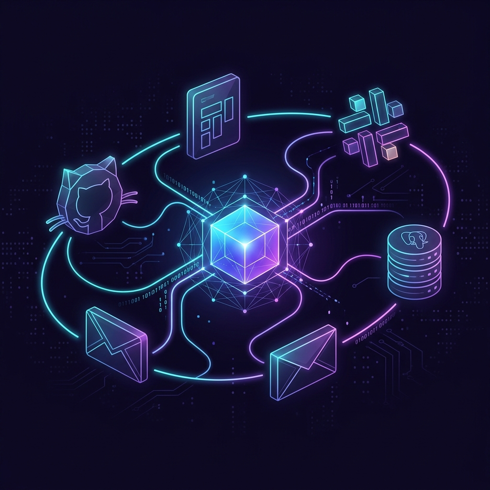

<div class="hero" markdown>

# Stop Chasing Status Updates.<br>Start Making Decisions.

<p class="subtitle">
We automate the manual work that drains your team — project reporting, ad-hoc data requests, executive summaries — using AI that runs <strong>100% on your machine</strong>.<br>
<strong>One workflow. 2-3 weeks. Measurable results. Free.</strong>
</p>

<div class="hero-badges" markdown>

[]()
[](security.md)
[]()
[](#free-pilot)

</div>

<div class="hero-cta" markdown>

[Start Your Free Pilot :material-rocket-launch:](#free-pilot){ .md-button .md-button--primary }
[See How It Works :material-arrow-down:](#the-problem){ .md-button }

</div>

<div class="hero-image-showcase">

</div>

</div>

---

<div class="metrics-bar" markdown>

<div class="metric-item">
<div class="metric-value" data-count="70">70%</div>
<div class="metric-label">of PM time spent gathering info</div>
</div>

<div class="metric-item">
<div class="metric-value" data-count="15">15+</div>
<div class="metric-label">ad-hoc data requests / week</div>
</div>

<div class="metric-item">
<div class="metric-value" data-count="3">3 hrs</div>
<div class="metric-label">every Friday on reports</div>
</div>

<div class="metric-item">
<div class="metric-value" data-count="44">$44K</div>
<div class="metric-label">annual cost per PM in wasted time</div>
</div>

</div>

---

## The Problem { #the-problem }

<div class="feature-grid" markdown>

<div class="feature-card" markdown>
### :material-clock-alert: PMs: 45 min of chaos every morning
Open Jira → Slack → GitHub → Spreadsheet. **Context-switching** just to answer "where do things stand?" — and the data is already stale.
</div>

<div class="feature-card" markdown>
### :material-database-alert: Data teams: buried in lookups
**15+ ad-hoc SQL requests/week**, each 30-60 min. That's 1-2 analysts doing glorified lookups instead of real analysis.
</div>

<div class="feature-card" markdown>
### :material-head-remove: Knowledge walks out the door
Your best analyst leaves → metric definitions, query patterns, business context: **all gone.** New hires spend 3 weeks just learning what "active customer" means.
</div>

<div class="feature-card" markdown>
### :material-close-circle: What you've tried — and why it fails
**Dashboards** → go stale. **AI chatbots** → hallucinate numbers. **Hiring** → problem scales with the team. The issue isn't people. **It's the work itself.**
</div>

</div>

---

## What We Automate

<div class="showcase-section">

<div class="showcase-item">
<div class="showcase-visual">
<div class="showcase-badge">🎩 Jean-Pierre</div>
<div class="carousel-track" id="jp-track">
<div class="carousel-slide"><div class="carousel-caption">Living Dashboard</div></div>
<div class="carousel-slide"><div class="carousel-caption">Fleet View</div></div>
<div class="carousel-slide"><div class="carousel-caption">Sprint Forge</div></div>
<div class="carousel-slide"><div class="carousel-caption">Delivery Pulse</div></div>
<div class="carousel-slide"><div class="carousel-caption">Team Pulse</div></div>
<div class="carousel-slide"><div class="carousel-caption">Strategic Board</div></div>
</div>
<div class="carousel-nav">
<button class="carousel-btn" onclick="var t=this.closest('.showcase-visual').querySelector('.carousel-track');t.scrollBy({left:-t.clientWidth,behavior:'smooth'})">❮</button>
<button class="carousel-btn" onclick="var t=this.closest('.showcase-visual').querySelector('.carousel-track');t.scrollBy({left:t.clientWidth,behavior:'smooth'})">❯</button>
</div>
<div class="carousel-dots">
<button class="carousel-dot active" onclick="this.closest('.showcase-visual').querySelector('.carousel-track').scrollTo({left:0,behavior:'smooth'})"></button>
<button class="carousel-dot" onclick="var t=this.closest('.showcase-visual').querySelector('.carousel-track');t.scrollTo({left:t.clientWidth,behavior:'smooth'})"></button>
<button class="carousel-dot" onclick="var t=this.closest('.showcase-visual').querySelector('.carousel-track');t.scrollTo({left:t.clientWidth*2,behavior:'smooth'})"></button>
<button class="carousel-dot" onclick="var t=this.closest('.showcase-visual').querySelector('.carousel-track');t.scrollTo({left:t.clientWidth*3,behavior:'smooth'})"></button>
<button class="carousel-dot" onclick="var t=this.closest('.showcase-visual').querySelector('.carousel-track');t.scrollTo({left:t.clientWidth*4,behavior:'smooth'})"></button>
<button class="carousel-dot" onclick="var t=this.closest('.showcase-visual').querySelector('.carousel-track');t.scrollTo({left:t.clientWidth*5,behavior:'smooth'})"></button>
</div>
</div>
<div class="showcase-content">
<h3>Project Reporting Automation</h3>
<p class="showcase-tagline">Connects to your GitHub, Jira, and Slack — turns chaotic project data into a real-time command center.</p>
<div class="outcome-list">
<div class="outcome-item"><span class="outcome-icon">✅</span><span><strong>Status reports</strong> generated automatically</span></div>
<div class="outcome-item"><span class="outcome-icon">✅</span><span><strong>Risks detected 2-3 weeks</strong> early</span></div>
<div class="outcome-item"><span class="outcome-icon">✅</span><span><strong>Executive reports</strong> in one click</span></div>
<div class="outcome-item"><span class="outcome-icon">✅</span><span><strong>All projects ranked</strong> by risk</span></div>
<div class="outcome-item"><span class="outcome-icon">✅</span><span><strong>24 interactive widgets</strong></span></div>
</div>
<div class="outcome-result">Result: ~10 hours/week saved per PM</div>
<a href="flavors/jean-pierre.md" class="md-button">See Full Feature Set →</a>
</div>
</div>

<div class="showcase-item">
<div class="showcase-visual">
<div class="showcase-badge">🔬 Michelle</div>
<div class="carousel-track" id="michelle-track">
<div class="carousel-slide"><div class="carousel-caption">Analytics Dashboard</div></div>
<div class="carousel-slide"><div class="carousel-caption">KPI Dashboard</div></div>
<div class="carousel-slide"><div class="carousel-caption">AI Chat</div></div>
<div class="carousel-slide"><div class="carousel-caption">Schema Browser</div></div>
<div class="carousel-slide"><div class="carousel-caption">Evolutionary Memory</div></div>
<div class="carousel-slide"><div class="carousel-caption">Test Harness</div></div>
</div>
<div class="carousel-nav">
<button class="carousel-btn" onclick="var t=this.closest('.showcase-visual').querySelector('.carousel-track');t.scrollBy({left:-t.clientWidth,behavior:'smooth'})">❮</button>
<button class="carousel-btn" onclick="var t=this.closest('.showcase-visual').querySelector('.carousel-track');t.scrollBy({left:t.clientWidth,behavior:'smooth'})">❯</button>
</div>
<div class="carousel-dots">
<button class="carousel-dot active" onclick="this.closest('.showcase-visual').querySelector('.carousel-track').scrollTo({left:0,behavior:'smooth'})"></button>
<button class="carousel-dot" onclick="var t=this.closest('.showcase-visual').querySelector('.carousel-track');t.scrollTo({left:t.clientWidth,behavior:'smooth'})"></button>
<button class="carousel-dot" onclick="var t=this.closest('.showcase-visual').querySelector('.carousel-track');t.scrollTo({left:t.clientWidth*2,behavior:'smooth'})"></button>
<button class="carousel-dot" onclick="var t=this.closest('.showcase-visual').querySelector('.carousel-track');t.scrollTo({left:t.clientWidth*3,behavior:'smooth'})"></button>
<button class="carousel-dot" onclick="var t=this.closest('.showcase-visual').querySelector('.carousel-track');t.scrollTo({left:t.clientWidth*4,behavior:'smooth'})"></button>
<button class="carousel-dot" onclick="var t=this.closest('.showcase-visual').querySelector('.carousel-track');t.scrollTo({left:t.clientWidth*5,behavior:'smooth'})"></button>
</div>
</div>
<div class="showcase-content">
<h3>Self-Service Analytics</h3>
<p class="showcase-tagline">Connects to your databases — anyone can ask data questions in plain English with verified, source-cited answers.</p>
<div class="outcome-list">
<div class="outcome-item"><span class="outcome-icon">✅</span><span><strong>Plain English → verified results</strong> in 3 sec</span></div>
<div class="outcome-item"><span class="outcome-icon">✅</span><span><strong>Exact SQL + source</strong> shown</span></div>
<div class="outcome-item"><span class="outcome-icon">✅</span><span><strong>Learns from corrections</strong></span></div>
<div class="outcome-item"><span class="outcome-icon">✅</span><span><strong>Knowledge retained</strong> permanently</span></div>
<div class="outcome-item"><span class="outcome-icon">✅</span><span><strong>Test Harness</strong> validates accuracy</span></div>
</div>
<div class="outcome-result">Result: ~15 hours/week freed per data team</div>
<a href="flavors/michelle.md" class="md-button">See Full Feature Set →</a>
</div>
</div>

</div>

---


## The ROI

<div class="roi-visual">

<div class="roi-card">
<div class="roi-before">
<div class="roi-label">Before</div>
<div class="roi-bar" style="--bar-width: 90%">~3 hrs/week</div>
<div class="roi-desc">Status gathering</div>
</div>
<div class="roi-after">
<div class="roi-label roi-label--after">After</div>
<div class="roi-bar roi-bar--after" style="--bar-width: 3%">10 sec</div>
<div class="roi-desc">Automated</div>
</div>
</div>

<div class="roi-card">
<div class="roi-before">
<div class="roi-label">Before</div>
<div class="roi-bar" style="--bar-width: 80%">~4 hrs/week</div>
<div class="roi-desc">Meeting prep + reports</div>
</div>
<div class="roi-after">
<div class="roi-label roi-label--after">After</div>
<div class="roi-bar roi-bar--after" style="--bar-width: 5%">One click</div>
<div class="roi-desc">Instant generation</div>
</div>
</div>

<div class="roi-card">
<div class="roi-before">
<div class="roi-label">Before</div>
<div class="roi-bar" style="--bar-width: 95%">30-60 min each, 15/week</div>
<div class="roi-desc">Ad-hoc data requests</div>
</div>
<div class="roi-after">
<div class="roi-label roi-label--after">After</div>
<div class="roi-bar roi-bar--after" style="--bar-width: 4%">3 sec</div>
<div class="roi-desc">Self-service</div>
</div>
</div>

</div>

<div class="roi-total">
<div class="roi-total-number">~25 hrs/week saved</div>
<div class="roi-total-money">$110,000+ in annual productivity gains</div>
<div class="roi-total-sub">Plus: risks caught 3 weeks early · institutional knowledge retained · eliminated team dependencies</div>
</div>

---

## How the Free Pilot Works

<div class="step-grid">

<div class="step-card">
<div class="step-num">1</div>
<h3>Pick One Workflow</h3>
<p>Which reporting workflow wastes the most time? Weekly status? Ad-hoc data requests? Executive reports? We start with <strong>the one that hurts most</strong>.</p>
</div>

<div class="step-card">
<div class="step-num">2</div>
<h3>We Automate It</h3>
<p>In <strong>2-3 weeks</strong>, we deploy the AI copilot on your machine, connect it to your tools, and automate the workflow. You see results, not a demo.</p>
</div>

<div class="step-card">
<div class="step-num">3</div>
<h3>You Measure Results</h3>
<p><strong>No cost. No commitment.</strong> You measure real time saved. If it works — we talk about expanding. If not — you wasted zero money.</p>
</div>

</div>

---

## Why This Is Different

<div class="differentiator-section">

<div class="differentiator-visual">

</div>

<div class="differentiator-grid">

<div class="diff-card" markdown>
<div class="diff-icon">🧠</div>
<h4>It Learns</h4>
<p>Every correction, preference, definition — <strong>remembered permanently</strong>. Gets measurably smarter every day. No re-explaining.</p>
</div>

<div class="diff-card" markdown>
<div class="diff-icon">✓</div>
<h4>It Proves</h4>
<p>Every data answer includes <strong>exact SQL, source tables, execution proof</strong>. If it can't verify, it flags it — architecturally.</p>
</div>

<div class="diff-card" markdown>
<div class="diff-icon">🔒</div>
<h4>It's Private</h4>
<p>Runs <strong>100% on your machine</strong>. Nothing leaves. Supports local AI (Ollama). Air-gap ready. GDPR-native.</p>
</div>

<div class="diff-card" markdown>
<div class="diff-icon">🔗</div>
<h4>It Connects</h4>
<p>Works with <strong>GitHub, Jira, Slack, PostgreSQL, MySQL, SQLite</strong>. No migration. No new dashboards.</p>
</div>

<div class="diff-card" markdown>
<div class="diff-icon">⚡</div>
<h4>It's Fast</h4>
<p><strong>10-minute setup.</strong> Install, connect, ask. First automated report same day. No infra needed.</p>
</div>

<div class="diff-card" markdown>
<div class="diff-icon">🎯</div>
<h4>It's Accurate</h4>
<p>Built-in <strong>Test Harness</strong> validates accuracy. Teams report <strong>95%+ accuracy</strong> — every answer provably sourced.</p>
</div>

</div>

</div>

---

## :material-shield-lock: Your Data Stays on Your Machine

<div class="privacy-section">

<div class="privacy-visual">

</div>

<div class="privacy-content">

<div class="privacy-badge">🔒 Nothing leaves. Ever.</div>

<div class="privacy-grid">

<div class="privacy-item">
<div class="privacy-status">❌ Never</div>
<div class="privacy-data">Project Data (Commits, PRs, Tickets)</div>
</div>

<div class="privacy-item">
<div class="privacy-status">❌ Never</div>
<div class="privacy-data">Database Queries & Results</div>
</div>

<div class="privacy-item">
<div class="privacy-status">❌ Never</div>
<div class="privacy-data">Chat Conversations</div>
</div>

<div class="privacy-item">
<div class="privacy-status">❌ Never</div>
<div class="privacy-data">Agent Memory & Knowledge</div>
</div>

<div class="privacy-item">
<div class="privacy-status">❌ Never</div>
<div class="privacy-data">API Keys & Credentials</div>
</div>

</div>

Using **Ollama**? Even your AI conversations stay 100% on your machine. Zero cloud, zero tracking.

[Learn more about our security model →](security.md)

</div>

</div>

---

## Built For

<div class="persona-strip">

<div class="persona-card">
<div class="persona-icon">👔</div>
<h4>Engineering Managers</h4>
<p>Automate status gathering → real-time project health</p>
</div>

<div class="persona-card">
<div class="persona-icon">📊</div>
<h4>Data & Analytics Leaders</h4>
<p>Eliminate ad-hoc request backlog → self-service in 3 sec</p>
</div>

<div class="persona-card">
<div class="persona-icon">📋</div>
<h4>Technical PMs</h4>
<p>3 report versions → one click, CTO/CFO/PMO in seconds</p>
</div>

<div class="persona-card">
<div class="persona-icon">🚀</div>
<h4>Startup CTOs</h4>
<p>Enterprise-grade intelligence on a laptop — no infra needed</p>
</div>

</div>

---

## :material-rocket-launch: Free AI Automation Pilot { #free-pilot }

<div class="cta-section">

<div class="cta-content">

<div class="cta-headline">No Cost. No Commitment. Just Results.</div>

<p>We pick <strong>ONE workflow</strong> — the one that wastes the most time — and automate it in <strong>2-3 weeks</strong>. You see a real, working result before spending anything. Our only ask: <strong>honest feedback.</strong></p>

<div class="cta-checklist">
<div class="cta-check">✅ Full deployment on your machine</div>
<div class="cta-check">✅ Connected to your tools — GitHub, Jira, Slack, or databases</div>
<div class="cta-check">✅ Measurable results — time saved, accuracy score, before/after</div>
<div class="cta-check">✅ No cost, no commitment — zero risk</div>
<div class="cta-check">✅ Priority support from the core team</div>
</div>

<div class="hero-cta">
<a href="mailto:info@unicolab.ai?subject=Free%20AI%20Automation%20Pilot&body=Hi%20Piotr%2C%0A%0AI%27m%20interested%20in%20the%20free%20automation%20pilot.%0A%0AMy%20role%3A%20%0AMy%20team%20size%3A%20%0AThe%20workflow%20that%20wastes%20the%20most%20time%3A%20%0ATools%20we%20use%3A%20%0A%0ALooking%20forward%20to%20hearing%20from%20you." class="md-button md-button--primary">Request Your Free Pilot ✉️</a>
<a href="https://github.com/UnicoLab/agentos/releases/latest" class="md-button">Download &amp; Try Yourself ⬇️</a>
</div>

<p style="text-align: center; margin-top: 1.5rem; font-size: 0.9rem;">📧 <strong>info@unicolab.ai</strong> · 💬 <strong>DM us on <a href="https://linkedin.com/company/unicolab">LinkedIn</a></strong> · 🌐 <strong><a href="https://unicolab.ai">unicolab.ai</a></strong></p>

</div>

</div>

---

??? info "For Technical Teams: Under the Hood"

    ### The AgentOS Platform

    AgentOS is a composable, local-first AI agent engine built in **Go 1.23** with a **React 19** frontend. Each copilot is a specialized "pack" — a domain configuration that includes tools, dashboards, AI persona, and workflows.

    **Architecture:**
    ```
    ┌─────────────────────────────────────────────────────┐
    │                   AgentOS Engine                     │
    │                                                      │
    │  ┌──────────┐  ┌──────────────┐  ┌──────────────┐  │
    │  │ Sidebar  │  │   Dashboard  │  │   Copilot    │  │
    │  │          │  │   (Bento)    │  │   (Chat)     │  │
    │  │ Modules  │  │   24 cards   │  │  Streaming   │  │
    │  │ per pack │  │  per pack    │  │  + Tools     │  │
    │  └──────────┘  └──────────────┘  └──────────────┘  │
    │                                                      │
    │  ┌────────────────────────────────────────────────┐  │
    │  │         Intelligence Layer (Go)                │  │
    │  │  Adaptive Memory · Knowledge Graph · Steering │  │
    │  │  Shared Brain · Error Patterns · Tool Wisdom  │  │
    │  │  Performance Tracker · User Adaptation         │  │
    │  └────────────────────────────────────────────────┘  │
    │                                                      │
    │  ┌────────────────────────────────────────────────┐  │
    │  │          Tool Gateway                          │  │
    │  │  GitHub · Jira · Slack · Database · Shell     │  │
    │  │  Gmail · Calendar · Docs · HTTP · Web Search  │  │
    │  └────────────────────────────────────────────────┘  │
    └─────────────────────────────────────────────────────┘
    ```

    **Available Packs:**

    | Pack | Persona | Domain | Status |
    |------|---------|--------|--------|
    | `aiflow-pm` | 🎩 Jean-Pierre | Project Management | ✅ Production |
    | `michelle` | 🔬 Michelle | Analytics Intelligence | ✅ Production |
    | `edith` | 🥐 Édith | Sales Intelligence / CRM | ✅ Available |
    | `freelancer` | 💼 Yvette | Freelancer PM | ✅ Available |
    | `office` | 🏢 Office | Productivity | ✅ Available |
    | `retail-ops` | 🏪 Retail | Operations | ✅ Available |

    **AI Providers:**

    | Provider | Type | Cost |
    |----------|------|------|
    | **Ollama** | 100% local | Free |
    | **OpenAI** | Cloud API | Per-token |
    | **Anthropic** | Cloud API | Per-token |
    | **Google Gemini** | Cloud API | Per-token |

    **Tech Stack:** Go 1.23 · React 19 · TypeScript · Vite 7 · SQLite · SSE Streaming · Glassmorphism UI

    **Quick Install:**
    ```bash
    curl -fsSL https://unicolab.github.io/agentos/install.sh | sh
    agentos serve
    # Open http://localhost:18080
    ```

    [Full Documentation →](getting-started/installation.md){ .md-button }
    [API Reference →](reference/api.md){ .md-button }

---

<p style="text-align: center; color: var(--md-default-fg-color--light); font-size: 0.9rem;">
<strong>Built with ❤️ by <a href="https://unicolab.ai">UnicoLab</a></strong><br>
AI automation consulting — Paris, France<br>
© 2024–2026 UnicoLab. All rights reserved.
</p>

<script>
document.addEventListener('DOMContentLoaded', function() {
  document.querySelectorAll('.showcase-visual').forEach(function(visual) {
    var track = visual.querySelector('.carousel-track');
    var dots = visual.querySelectorAll('.carousel-dot');
    if (!track || !dots.length) return;
    track.addEventListener('scroll', function() {
      var idx = Math.round(track.scrollLeft / track.clientWidth);
      dots.forEach(function(d, i) {
        d.classList.toggle('active', i === idx);
      });
    });
  });
});
</script>

