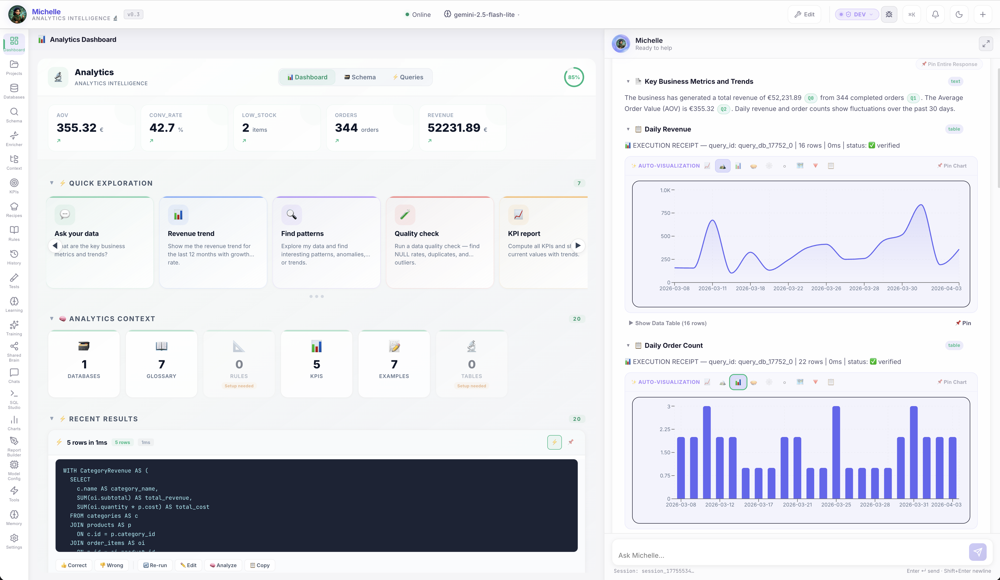
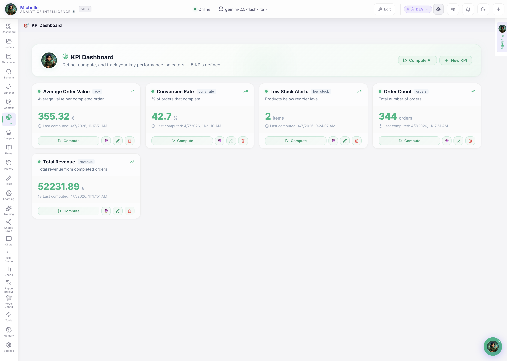
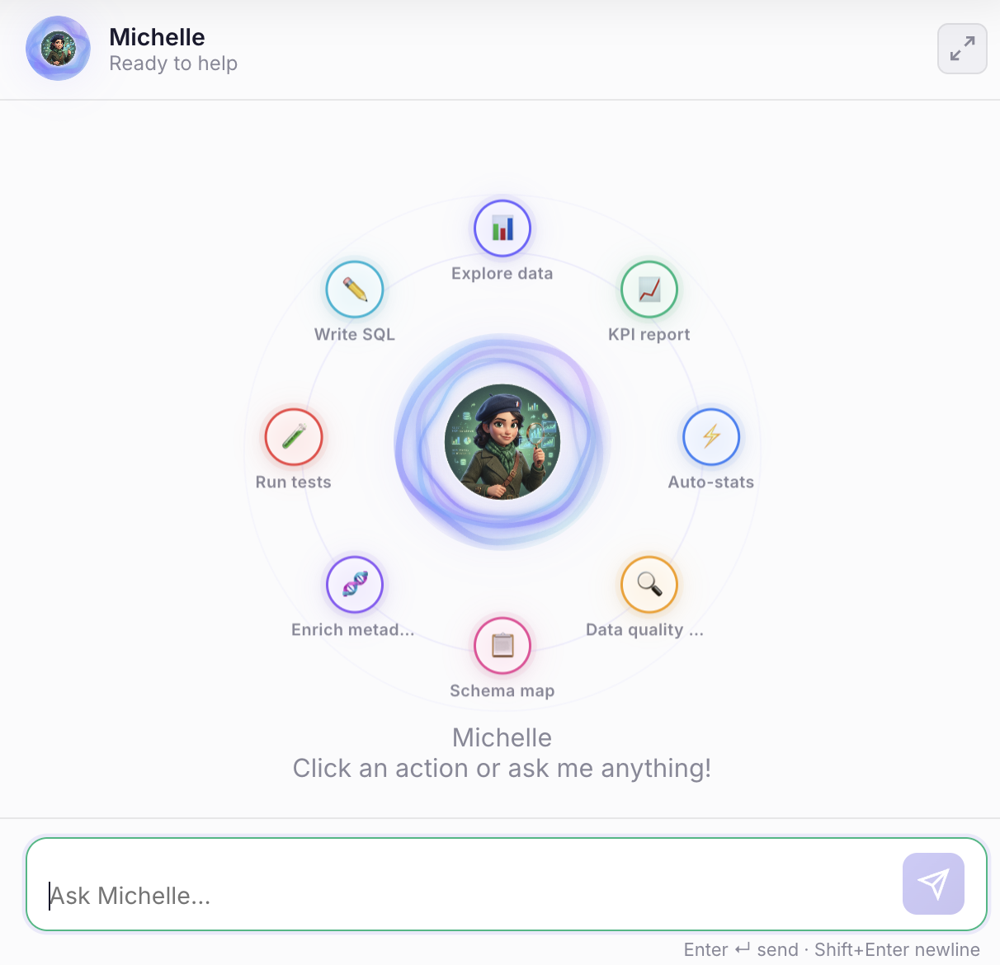
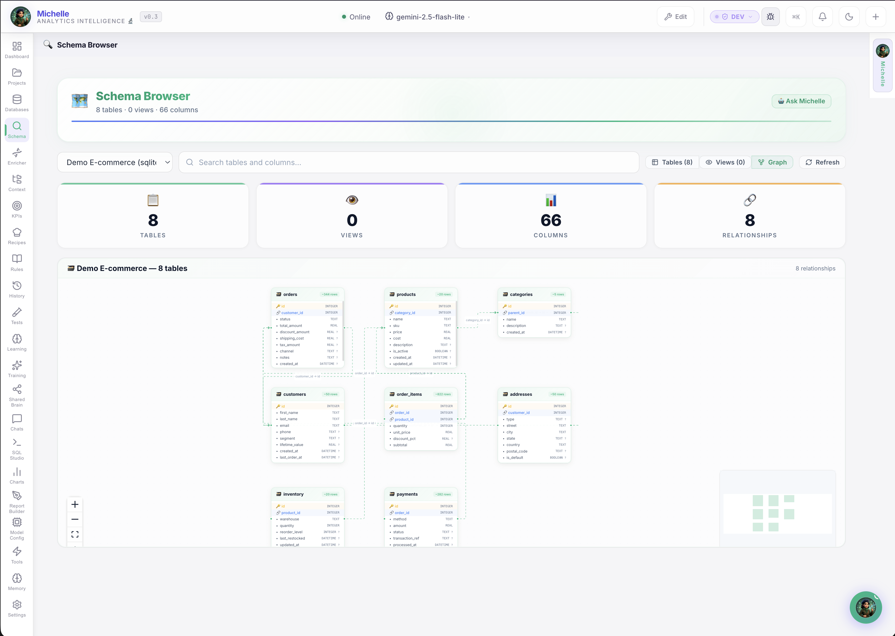
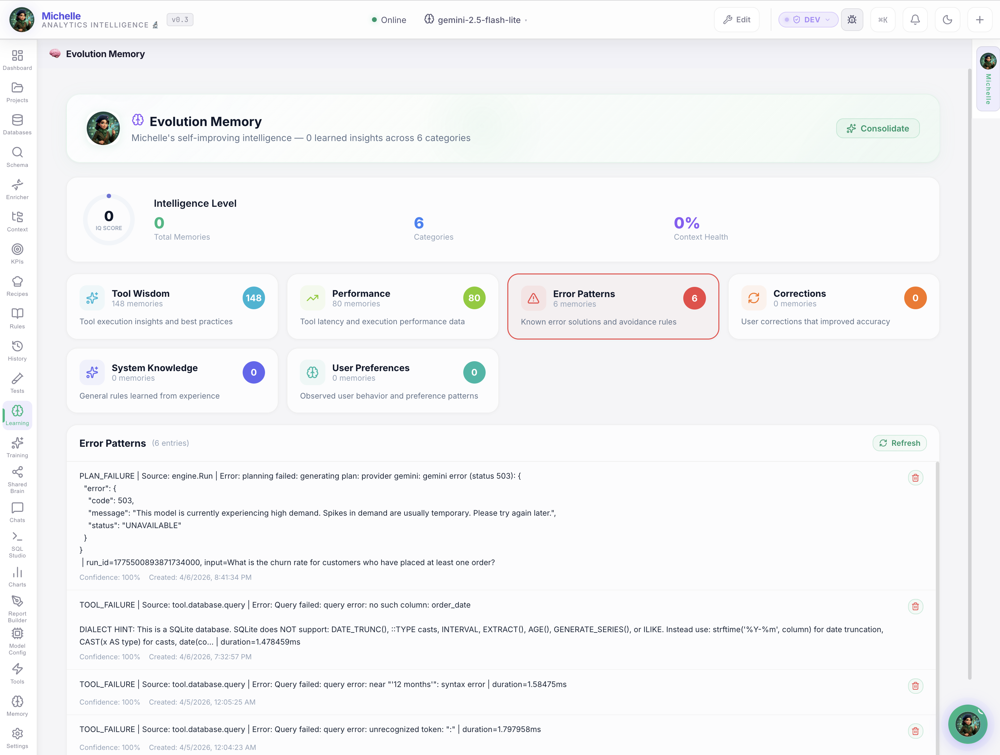
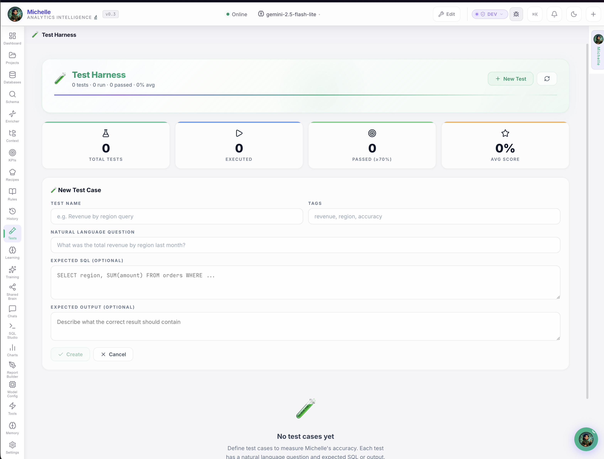
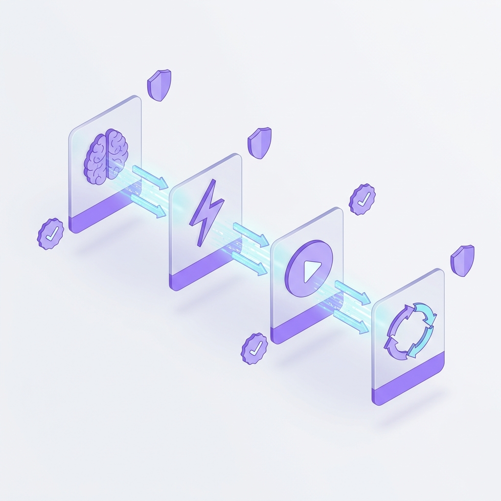

<div class="hero" markdown>

# Meet Jean-Pierre & Michelle.<br>AI That Actually *Works*.

<p class="subtitle">
Two purpose-built AI copilots that automate project reporting and analytics intelligence.<br>
They connect to your tools, learn your domain, validate every answer, and compound intelligence daily.<br>
<strong>100% on your machine. Zero cloud. Part of the <a href="https://ai-flow.ai" style="color: inherit; text-decoration: underline">AIFlow</a> ecosystem.</strong>
</p>

<div class="hero-badges" markdown>

[]()
[](security.md)
[]()
[](#founding-member)

</div>

<div class="hero-cta" markdown>

[Become a Founding Member :material-rocket-launch:](#founding-member){ .md-button .md-button--primary }
[See How It Works :material-arrow-down:](#what-they-do){ .md-button }

</div>

<div class="hero-image-showcase">

</div>

</div>

---

<div class="metrics-bar" markdown>

<div class="metric-item">
<div class="metric-value" data-count="25">25+</div>
<div class="metric-label">hrs/week saved per team</div>
</div>

<div class="metric-item">
<div class="metric-value" data-count="3">3 sec</div>
<div class="metric-label">from question to verified answer</div>
</div>

<div class="metric-item">
<div class="metric-value" data-count="9">9</div>
<div class="metric-label">anti-hallucination layers</div>
</div>

<div class="metric-item">
<div class="metric-value" data-count="0">€0</div>
<div class="metric-label">founding member pilot — results first</div>
</div>

</div>

---

## What They Automate For You { #what-they-do }

<div class="flagship-duo">

<div class="flagship-hero-card">
<div class="flagship-hero-header">

<div>
<h3>🎩 Jean-Pierre</h3>
<p class="flagship-role">Project Reporting Automation</p>
</div>
</div>
<p class="flagship-pitch">Connects to GitHub, Jira, and Slack — turns chaotic project data into a real-time command center with <strong>proactive risk scoring</strong> and <strong>24/7 background monitoring</strong>.</p>
<div class="flagship-outcomes">
<div class="flagship-outcome"><span>✅</span> Status reports generated automatically — no manual gathering</div>
<div class="flagship-outcome"><span>✅</span> Risks detected 2-3 weeks early via real-time scoring (0-100)</div>
<div class="flagship-outcome"><span>✅</span> Executive reports in one click — CTO / CFO / PMO variants</div>
<div class="flagship-outcome"><span>✅</span> All projects ranked by risk across your portfolio</div>
<div class="flagship-outcome"><span>✅</span> Evolution Memory — learns your preferences, never re-explain</div>
</div>
<div class="flagship-result">~10 hrs/week saved per project manager</div>
<a href="flavors/jean-pierre.md" class="md-button">Explore Jean-Pierre →</a>
</div>

<div class="flagship-hero-card flagship-hero-card--michelle">
<div class="flagship-hero-header">

<div>
<h3>🔬 Michelle</h3>
<p class="flagship-role">Analytics Intelligence</p>
</div>
</div>
<p class="flagship-pitch">Connects to your databases — anyone can ask data questions in plain English with <strong>verified, source-cited answers</strong> backed by a <strong>9-layer anti-hallucination architecture</strong>.</p>
<div class="flagship-outcomes">
<div class="flagship-outcome"><span>✅</span> Plain English → verified results in 3 seconds</div>
<div class="flagship-outcome"><span>✅</span> Exact SQL + source tables shown — full auditability</div>
<div class="flagship-outcome"><span>✅</span> Learns from corrections — never makes the same mistake twice</div>
<div class="flagship-outcome"><span>✅</span> Shared Brain — knowledge retained, governed via PR review</div>
<div class="flagship-outcome"><span>✅</span> KPI engine with cron schedules, thresholds, sparklines</div>
</div>
<div class="flagship-result">~15 hrs/week freed per data team</div>
<a href="flavors/michelle.md" class="md-button">Explore Michelle →</a>
</div>

</div>

---

## See the Results

<div class="showcase-section">

<div class="showcase-item">
<div class="showcase-visual">
<div class="showcase-badge">🎩 Jean-Pierre</div>
<div class="carousel-track" id="jp-track">
<div class="carousel-slide"><div class="carousel-caption">Living Dashboard</div></div>
<div class="carousel-slide"><div class="carousel-caption">Fleet View</div></div>
<div class="carousel-slide"><div class="carousel-caption">Sprint Forge</div></div>
<div class="carousel-slide"><div class="carousel-caption">Delivery Pulse</div></div>
<div class="carousel-slide"><div class="carousel-caption">Team Pulse</div></div>
<div class="carousel-slide"><div class="carousel-caption">Strategic Board</div></div>
</div>
<div class="carousel-nav">
<button class="carousel-btn" onclick="var t=this.closest('.showcase-visual').querySelector('.carousel-track');t.scrollBy({left:-t.clientWidth,behavior:'smooth'})">❮</button>
<button class="carousel-btn" onclick="var t=this.closest('.showcase-visual').querySelector('.carousel-track');t.scrollBy({left:t.clientWidth,behavior:'smooth'})">❯</button>
</div>
<div class="carousel-dots">
<button class="carousel-dot active" onclick="this.closest('.showcase-visual').querySelector('.carousel-track').scrollTo({left:0,behavior:'smooth'})"></button>
<button class="carousel-dot" onclick="var t=this.closest('.showcase-visual').querySelector('.carousel-track');t.scrollTo({left:t.clientWidth,behavior:'smooth'})"></button>
<button class="carousel-dot" onclick="var t=this.closest('.showcase-visual').querySelector('.carousel-track');t.scrollTo({left:t.clientWidth*2,behavior:'smooth'})"></button>
<button class="carousel-dot" onclick="var t=this.closest('.showcase-visual').querySelector('.carousel-track');t.scrollTo({left:t.clientWidth*3,behavior:'smooth'})"></button>
<button class="carousel-dot" onclick="var t=this.closest('.showcase-visual').querySelector('.carousel-track');t.scrollTo({left:t.clientWidth*4,behavior:'smooth'})"></button>
<button class="carousel-dot" onclick="var t=this.closest('.showcase-visual').querySelector('.carousel-track');t.scrollTo({left:t.clientWidth*5,behavior:'smooth'})"></button>
</div>
</div>
<div class="showcase-content">
<h3>Project Reporting Automation</h3>
<p class="showcase-tagline">From chaotic project data → real-time command center with proactive risk scoring, fleet intelligence, and executive-ready reports.</p>
<div class="outcome-list">
<div class="outcome-item"><span class="outcome-icon">📊</span><span><strong>Living Dashboard</strong> — 24 bento cards, always current</span></div>
<div class="outcome-item"><span class="outcome-icon">🚨</span><span><strong>Risk Scoring</strong> — 0-100 scale with 2-3 week early warning</span></div>
<div class="outcome-item"><span class="outcome-icon">📋</span><span><strong>Fleet View</strong> — all projects ranked by risk</span></div>
<div class="outcome-item"><span class="outcome-icon">📝</span><span><strong>One-Click Reports</strong> — CTO, CFO, PMO variants</span></div>
<div class="outcome-item"><span class="outcome-icon">🧠</span><span><strong>Evolution Memory</strong> — learns your style, never re-explain</span></div>
</div>
</div>
</div>

<div class="showcase-item">
<div class="showcase-visual">
<div class="showcase-badge">🔬 Michelle</div>
<div class="carousel-track" id="michelle-track">
<div class="carousel-slide"><div class="carousel-caption">Analytics Dashboard</div></div>
<div class="carousel-slide"><div class="carousel-caption">KPI Dashboard</div></div>
<div class="carousel-slide"><div class="carousel-caption">AI Chat</div></div>
<div class="carousel-slide"><div class="carousel-caption">Schema Browser</div></div>
<div class="carousel-slide"><div class="carousel-caption">Evolutionary Memory</div></div>
<div class="carousel-slide"><div class="carousel-caption">Test Harness</div></div>
</div>
<div class="carousel-nav">
<button class="carousel-btn" onclick="var t=this.closest('.showcase-visual').querySelector('.carousel-track');t.scrollBy({left:-t.clientWidth,behavior:'smooth'})">❮</button>
<button class="carousel-btn" onclick="var t=this.closest('.showcase-visual').querySelector('.carousel-track');t.scrollBy({left:t.clientWidth,behavior:'smooth'})">❯</button>
</div>
<div class="carousel-dots">
<button class="carousel-dot active" onclick="this.closest('.showcase-visual').querySelector('.carousel-track').scrollTo({left:0,behavior:'smooth'})"></button>
<button class="carousel-dot" onclick="var t=this.closest('.showcase-visual').querySelector('.carousel-track');t.scrollTo({left:t.clientWidth,behavior:'smooth'})"></button>
<button class="carousel-dot" onclick="var t=this.closest('.showcase-visual').querySelector('.carousel-track');t.scrollTo({left:t.clientWidth*2,behavior:'smooth'})"></button>
<button class="carousel-dot" onclick="var t=this.closest('.showcase-visual').querySelector('.carousel-track');t.scrollTo({left:t.clientWidth*3,behavior:'smooth'})"></button>
<button class="carousel-dot" onclick="var t=this.closest('.showcase-visual').querySelector('.carousel-track');t.scrollTo({left:t.clientWidth*4,behavior:'smooth'})"></button>
<button class="carousel-dot" onclick="var t=this.closest('.showcase-visual').querySelector('.carousel-track');t.scrollTo({left:t.clientWidth*5,behavior:'smooth'})"></button>
</div>
</div>
<div class="showcase-content">
<h3>Analytics Intelligence</h3>
<p class="showcase-tagline">From ad-hoc SQL requests → self-service analytics with verified answers, interactive dashboards, and automated KPI tracking.</p>
<div class="outcome-list">
<div class="outcome-item"><span class="outcome-icon">💬</span><span><strong>Plain English</strong> → verified SQL in 3 seconds</span></div>
<div class="outcome-item"><span class="outcome-icon">📈</span><span><strong>9 Chart Types</strong> — pins, gauges, sparklines, drill-downs</span></div>
<div class="outcome-item"><span class="outcome-icon">🎯</span><span><strong>KPI Engine</strong> — cron schedules, thresholds, automated alerts</span></div>
<div class="outcome-item"><span class="outcome-icon">🔍</span><span><strong>Source Citations</strong> — clickable provenance on every number</span></div>
<div class="outcome-item"><span class="outcome-icon">🧠</span><span><strong>Shared Brain</strong> — team knowledge retained, governed via PRs</span></div>
</div>
</div>
</div>

</div>

---

## :material-connection: Part of the AIFlow Ecosystem { #aiflow }

<div class="aiflow-strip">
<div class="aiflow-strip-content">
<div class="aiflow-strip-icon">🔗</div>
<div>
<h3>AgentOS + AIFlow = Complete Intelligence</h3>
<p><strong>AgentOS</strong> agents are the local compute nodes — running on your machine, ensuring data sovereignty and low-latency processing. <strong>AIFlow</strong> is the centralized brain that sees your entire portfolio. Together, they form the <strong>hub-and-spoke intelligence architecture</strong>.</p>
<a href="https://ai-flow.ai" class="md-button" style="margin-top: 0.75rem;">Explore AIFlow Platform →</a>
</div>
</div>
</div>

---

## :material-shield-check: Why They Don't Hallucinate { #anti-hallucination }

<div class="pillars-section">

<div class="pillar-card pillar-card--evolves">
<div class="pillar-header">
<div class="pillar-icon">🧬</div>
<h3>They Evolve</h3>
</div>
<p class="pillar-lead">Generic AI resets every session. These agents get <strong>measurably smarter every week</strong>.</p>
<div class="pillar-details">
<div class="pillar-detail">6-namespace Evolution Memory — errors, corrections, tool wisdom, user adaptation, performance, knowledge</div>
<div class="pillar-detail">Same question, better answer next week — tracked and verifiable</div>
<div class="pillar-detail">Shared Brain: GitHub-backed, PR-reviewed → when your analyst leaves, knowledge stays</div>
</div>
</div>

<div class="pillar-card pillar-card--validates">
<div class="pillar-header">
<div class="pillar-icon">✓</div>
<h3>They Validate</h3>
</div>
<p class="pillar-lead">Every answer comes with <strong>proof</strong> — exact SQL, source tables, execution evidence.</p>
<div class="pillar-details">
<div class="pillar-detail">9-layer anti-hallucination architecture: Triage → Generate → Execute → Learn</div>
<div class="pillar-detail">Clickable [source:N] provenance badges on every data answer</div>
<div class="pillar-detail">Business glossary + rules enforced architecturally — not just in prompts</div>
</div>
</div>

<div class="pillar-card pillar-card--private">
<div class="pillar-header">
<div class="pillar-icon">🔒</div>
<h3>They Stay Private</h3>
</div>
<p class="pillar-lead"><strong>100% on your machine.</strong> Nothing — not data, not queries, not memory — leaves.</p>
<div class="pillar-details">
<div class="pillar-detail">Single binary, no Docker, no cloud — runs locally on macOS, Linux, Windows</div>
<div class="pillar-detail">Supports Ollama for fully local AI — zero API calls possible</div>
<div class="pillar-detail">GDPR-native, air-gap ready, no telemetry, no tracking</div>
</div>
</div>

</div>

---

## :material-shield-check: 9 Layers of Anti-Hallucination

<div class="hallucination-section">

<div class="hallucination-visual">

</div>

<div class="hallucination-content">

<p class="section-intro" style="text-align:left;margin:0 0 1.5rem">Text-to-SQL tools generate queries. Michelle generates queries, <strong>validates them</strong>, learns from corrections, shares knowledge across your team, and gets measurably more accurate every day.</p>

<div class="pipeline-visual">
<div class="pipeline-step-card">
<div class="pipeline-step-icon">🧠</div>
<div class="pipeline-step-name">Triage</div>
<div class="pipeline-step-desc">Can it be answered from context?</div>
</div>
<div class="pipeline-arrow-icon">→</div>
<div class="pipeline-step-card">
<div class="pipeline-step-icon">⚡</div>
<div class="pipeline-step-name">Generate</div>
<div class="pipeline-step-desc">SQL with full schema context</div>
</div>
<div class="pipeline-arrow-icon">→</div>
<div class="pipeline-step-card">
<div class="pipeline-step-icon">▶️</div>
<div class="pipeline-step-name">Execute</div>
<div class="pipeline-step-desc">Run with provenance tracking</div>
</div>
<div class="pipeline-arrow-icon">→</div>
<div class="pipeline-step-card">
<div class="pipeline-step-icon">📈</div>
<div class="pipeline-step-name">Learn</div>
<div class="pipeline-step-desc">Record into evolution memory</div>
</div>
</div>

<div class="layer-grid">
<div class="layer-item"><strong>Adaptive Schema</strong> — Tiered injection handles 100+ tables</div>
<div class="layer-item"><strong>Business Glossary</strong> — Your definitions, injected per prompt</div>
<div class="layer-item"><strong>Business Rules</strong> — "Exclude deleted" enforced architecturally</div>
<div class="layer-item"><strong>Validated Examples</strong> — Approved NL→SQL as few-shot training</div>
<div class="layer-item"><strong>Evolution Memory</strong> — 6 namespaces that persist across sessions</div>
<div class="layer-item"><strong>Semantic Joins</strong> — LLM-assisted FK discovery beyond constraints</div>
<div class="layer-item"><strong>Provenance Tags</strong> — Clickable [source:N] citations on every answer</div>
<div class="layer-item"><strong>Test Harness</strong> — Validate accuracy before deploying to team</div>
<div class="layer-item"><strong>Multi-Model Routing</strong> — Right model per task: SQL, Q&A, enrichment</div>
</div>

</div>

</div>

---

## Not Another Chatbot. An Intelligence Engine. { #why-not-claude }

<div class="comparison-section" markdown>

<p class="section-intro">Claude is brilliant at conversation. But <strong>conversation isn't operations, and "generating SQL" isn't analytics you can trust</strong>. We built an entire ecosystem — self-reflection, evolving memory, federated knowledge, business context enforcement, provenance tracking, anomaly detection, auto-corrections, integrated reporting — to make our agents <strong>provably trustworthy</strong>.</p>

<div class="comparison-table-wrapper">
<table class="comparison-table">
<thead>
<tr>
<th>Capability</th>
<th>Claude / ChatGPT + MCP</th>
<th>Jean-Pierre & Michelle</th>
</tr>
</thead>
<tbody>
<tr>
<td><strong>Schema knowledge</strong></td>
<td class="cmp-part">⚠️ MCP can fetch — no tiered caching</td>
<td class="cmp-yes">✅ Auto-synced with adaptive tiered injection</td>
</tr>
<tr>
<td><strong>Persistent memory</strong></td>
<td class="cmp-no">❌ Session resets — SKILLS.md is static</td>
<td class="cmp-yes">✅ 6-namespace Evolution Memory</td>
</tr>
<tr>
<td><strong>Query validation</strong></td>
<td class="cmp-no">❌ You validate manually</td>
<td class="cmp-yes">✅ Triage → Generate → Execute → Learn</td>
</tr>
<tr>
<td><strong>KPI tracking</strong></td>
<td class="cmp-no">❌ No persistence, schedules, thresholds</td>
<td class="cmp-yes">✅ KPI engine with cron, history, alerts</td>
</tr>
<tr>
<td><strong>Team knowledge</strong></td>
<td class="cmp-no">❌ Each user starts from zero</td>
<td class="cmp-yes">✅ GitHub-backed Shared Brain + PR review</td>
</tr>
<tr>
<td><strong>Data sovereignty</strong></td>
<td class="cmp-no">❌ Data goes to Anthropic / OpenAI</td>
<td class="cmp-yes">✅ Local binary, air-gap capable</td>
</tr>
<tr>
<td><strong>Interactive dashboards</strong></td>
<td class="cmp-no">❌ Text + static artifacts</td>
<td class="cmp-yes">✅ Charts, pins, KPI gauges, drill-downs</td>
</tr>
<tr>
<td><strong>Proactive monitoring</strong></td>
<td class="cmp-no">❌ Reactive — you ask, it answers</td>
<td class="cmp-yes">✅ Background daemon with risk scoring</td>
</tr>
<tr>
<td><strong>Business glossary</strong></td>
<td class="cmp-part">⚠️ Static SKILLS.md — no enforcement</td>
<td class="cmp-yes">✅ Dynamic glossary + rules, enforced per query</td>
</tr>
<tr>
<td><strong>Improves over time</strong></td>
<td class="cmp-no">❌ Same accuracy week 1 and week 52</td>
<td class="cmp-yes">✅ Measurably smarter every week</td>
</tr>
</tbody>
</table>
</div>

!!! quote "The Bottom Line"
    **Claude is a brilliant conversationalist.** But can you stake your board deck on it? Jean-Pierre and Michelle are purpose-built operational systems — they live on your machine, prove every claim with transparent action chains, learn from every correction, share knowledge across your team, and get measurably more accurate every week. One is a tool. The other is an **intelligence system you can trust**.

</div>

---

## The Time You're Losing Today { #the-problem }

<p class="section-intro">Every week, your team loses 25+ hours to manual reporting, ad-hoc data requests, and knowledge gaps. Here's where the time goes.</p>

<div class="feature-grid" markdown>

<div class="feature-card" markdown>
### :material-clock-alert: PMs: 45 min of chaos every morning
Open Jira → Slack → GitHub → Spreadsheet. **Context-switching** just to answer "where do things stand?" — and the data is already stale.
</div>

<div class="feature-card" markdown>
### :material-database-alert: Data teams: buried in lookups
**15+ ad-hoc SQL requests/week**, each 30-60 min. That's 1-2 analysts doing glorified lookups instead of real analysis.
</div>

<div class="feature-card" markdown>
### :material-head-remove: Knowledge walks out the door
Your best analyst leaves → metric definitions, query patterns, business context: **all gone.** New hires spend 3 weeks just learning what "active customer" means.
</div>

<div class="feature-card" markdown>
### :material-robot-confused: AI chatbots hallucinate numbers
You tried ChatGPT / Claude for analytics. It **invents data**, forgets corrections next session, and every team member starts from zero. The issue isn't AI. **It's stateless AI.**
</div>

</div>

---

## The Time You Get Back

<p class="section-intro">Side-by-side: what your team does manually today vs. what the agents automate.</p>

<div class="roi-visual">

<div class="roi-card">
<div class="roi-before">
<div class="roi-label">Before</div>
<div class="roi-bar" style="--bar-width: 90%">~3 hrs/week</div>
<div class="roi-desc">Status gathering</div>
</div>
<div class="roi-after">
<div class="roi-label roi-label--after">After</div>
<div class="roi-bar roi-bar--after" style="--bar-width: 3%">10 sec</div>
<div class="roi-desc">Automated</div>
</div>
</div>

<div class="roi-card">
<div class="roi-before">
<div class="roi-label">Before</div>
<div class="roi-bar" style="--bar-width: 80%">~4 hrs/week</div>
<div class="roi-desc">Meeting prep + reports</div>
</div>
<div class="roi-after">
<div class="roi-label roi-label--after">After</div>
<div class="roi-bar roi-bar--after" style="--bar-width: 5%">One click</div>
<div class="roi-desc">Instant generation</div>
</div>
</div>

<div class="roi-card">
<div class="roi-before">
<div class="roi-label">Before</div>
<div class="roi-bar" style="--bar-width: 95%">30-60 min each, 15/week</div>
<div class="roi-desc">Ad-hoc data requests</div>
</div>
<div class="roi-after">
<div class="roi-label roi-label--after">After</div>
<div class="roi-bar roi-bar--after" style="--bar-width: 4%">3 sec</div>
<div class="roi-desc">Self-service</div>
</div>
</div>

<div class="roi-card">
<div class="roi-before">
<div class="roi-label">Before</div>
<div class="roi-bar" style="--bar-width: 85%">3 weeks onboarding</div>
<div class="roi-desc">New hire learns definitions</div>
</div>
<div class="roi-after">
<div class="roi-label roi-label--after">After</div>
<div class="roi-bar roi-bar--after" style="--bar-width: 3%">Instant</div>
<div class="roi-desc">Shared Brain has it all</div>
</div>
</div>

</div>

<div class="roi-total">
<div class="roi-total-number">~25 hrs/week saved</div>
<div class="roi-total-money">€110,000+ in annual productivity gains</div>
<div class="roi-total-sub">Plus: risks caught 3 weeks early · institutional knowledge retained · eliminated team dependencies · measurably improving accuracy</div>
</div>

---

## How the Founding Member Program Works

<p class="section-intro">Zero risk. We automate one workflow in 2-3 weeks — you measure the results. Founding Members get priority onboarding, direct access, and shape the product roadmap.</p>

<div class="step-grid">

<div class="step-card">
<div class="step-num">1</div>
<h3>Pick One Workflow</h3>
<p>Which reporting workflow wastes the most time? Weekly status? Ad-hoc data requests? Executive reports? We start with <strong>the one that hurts most</strong>.</p>
</div>

<div class="step-card">
<div class="step-num">2</div>
<h3>We Automate It</h3>
<p>In <strong>2-3 weeks</strong>, we deploy the agent on your machine, connect it to your tools, configure your Shared Brain, and automate the workflow end-to-end.</p>
</div>

<div class="step-card">
<div class="step-num">3</div>
<h3>You Measure Results</h3>
<p><strong>No cost. No commitment.</strong> You measure real time saved, accuracy scores, and evolution learning rate. If it works — we expand. If not — zero money wasted.</p>
</div>

</div>

---

## :material-shield-lock: Your Data Stays on Your Machine

<div class="privacy-section">

<div class="privacy-visual">

</div>

<div class="privacy-content">

<div class="privacy-badge">🔒 Nothing leaves. Ever.</div>

<div class="privacy-grid">

<div class="privacy-item">
<div class="privacy-status">❌ Never</div>
<div class="privacy-data">Project Data (Commits, PRs, Tickets)</div>
</div>

<div class="privacy-item">
<div class="privacy-status">❌ Never</div>
<div class="privacy-data">Database Queries & Results</div>
</div>

<div class="privacy-item">
<div class="privacy-status">❌ Never</div>
<div class="privacy-data">Chat Conversations</div>
</div>

<div class="privacy-item">
<div class="privacy-status">❌ Never</div>
<div class="privacy-data">Agent Memory & Knowledge</div>
</div>

<div class="privacy-item">
<div class="privacy-status">❌ Never</div>
<div class="privacy-data">API Keys & Credentials</div>
</div>

</div>

Using **Ollama**? Even your AI conversations stay 100% on your machine. Zero cloud, zero tracking.

[Learn more about our security model →](security.md)

</div>

</div>

---

## Built For Your Role

<div class="persona-strip">

<div class="persona-card">
<div class="persona-icon">🏗️</div>
<h4>CTOs & VP Engineering</h4>
<p>Portfolio risk visibility → proactive decisions, not fire drills</p>
</div>

<div class="persona-card">
<div class="persona-icon">👔</div>
<h4>Engineering Managers</h4>
<p>Automate status gathering → real-time project health</p>
</div>

<div class="persona-card">
<div class="persona-icon">📊</div>
<h4>Data & Analytics Leaders</h4>
<p>Eliminate ad-hoc request backlog → self-service in 3 sec</p>
</div>

<div class="persona-card">
<div class="persona-icon">📋</div>
<h4>Technical PMs</h4>
<p>3 report variants → one click, CTO/CFO/PMO in seconds</p>
</div>

</div>

---

## :material-rocket-launch: Become a Founding Member { #founding-member }

<div class="cta-section">

<div class="cta-content">

<div class="cta-headline">No Cost. Direct Access. Shape the Roadmap.</div>

<p>We pick <strong>ONE workflow</strong> — the one that wastes the most time — and automate it in <strong>2-3 weeks</strong>. You see a real, working result before spending anything. As a Founding Member, you get <strong>direct access to the team, priority support, and influence on the product roadmap.</strong></p>

<div class="cta-checklist">
<div class="cta-check">✅ Full deployment on your machine</div>
<div class="cta-check">✅ Connected to your tools — GitHub, Jira, Slack, or databases</div>
<div class="cta-check">✅ Shared Brain configured with your team's KPIs & glossary</div>
<div class="cta-check">✅ Measurable results — time saved, accuracy score, evolution rate</div>
<div class="cta-check">✅ No cost, no commitment — Founding Member pricing locked in</div>
</div>

<div class="hero-cta">
<a href="mailto:info@unicolab.ai?subject=Founding%20Member%20Application&body=Hi%20Piotr%2C%0A%0AI%27d%20like%20to%20apply%20as%20a%20Founding%20Member.%0A%0AMy%20role%3A%20%0AMy%20team%20size%3A%20%0AThe%20workflow%20that%20wastes%20the%20most%20time%3A%20%0ATools%20we%20use%3A%20%0A%0ALooking%20forward%20to%20hearing%20from%20you." class="md-button md-button--primary">Apply as Founding Member ✉️</a>
<a href="https://github.com/UnicoLab/agentos/releases/latest" class="md-button">Download &amp; Try Yourself ⬇️</a>
</div>

<p style="text-align: center; margin-top: 1.5rem; font-size: 0.9rem;">📧 <strong>info@unicolab.ai</strong> · 💬 <strong>DM us on <a href="https://linkedin.com/company/unicolab">LinkedIn</a></strong> · 🌐 <strong><a href="https://ai-flow.ai">ai-flow.ai</a></strong></p>

</div>

</div>

---

??? info "For Technical Teams: The Platform"

    ### AgentOS — Composable AI Copilots

    AgentOS is a **LEGO-like platform** for building and deploying specialized AI copilots. A battle-tested engine handles the hard parts — streaming AI orchestration, adaptive memory, tool execution, and real-time dashboards — while domain-specific **packs** configure each copilot for a particular role.

    **Think of it as:** Engine (shared) + Pack (specialized) = Copilot ready in days, not months.

    **Available Copilots:**

    | Copilot | Persona | Domain | Status |
    |---------|---------|--------|--------|
    | 🎩 Jean-Pierre | AI PM Copilot | Project Management | ✅ Production |
    | 📊 Michelle | Analytics Intelligence | Data & BI | ✅ Production |
    | 🥐 Édith | Sales Intelligence | CRM & Pipeline | ✅ Available |
    | 💼 Yvette | Freelancer PM | Independent Consulting | ✅ Available |
    | 🏢 Office | Productivity | Document & Workflow | ✅ Available |
    | 🛒 Retail Ops | Operations | Inventory & Analytics | ✅ Available |

    **AI Providers:**

    | Provider | Type | Cost |
    |----------|------|------|
    | **Ollama** | 100% local | Free |
    | **OpenAI** | Cloud API | Per-token |
    | **Anthropic** | Cloud API | Per-token |
    | **Google Gemini** | Cloud API | Per-token |

    **Key:** Pre-compiled binary · Runs on macOS, Linux, Windows · Single-command install · Air-gap ready with Ollama

    **Quick Install:**
    ```bash
    curl -fsSL https://unicolab.github.io/agentos/install.sh | sh
    agentos serve
    # Open http://localhost:18080
    ```

    [Full Documentation →](getting-started/installation.md){ .md-button }
    [Explore Copilots →](flavors/index.md){ .md-button }

---

<p style="text-align: center; color: var(--md-default-fg-color--light); font-size: 0.9rem;">
<strong>Built with ❤️ by <a href="https://ai-flow.ai">UnicoLab</a></strong><br>
Part of the <strong><a href="https://ai-flow.ai">AIFlow</a></strong> ecosystem · AI automation consulting — Paris, France<br>
© 2024–2026 UnicoLab. All rights reserved.
</p>

<script>
document.addEventListener('DOMContentLoaded', function() {
  document.querySelectorAll('.showcase-visual').forEach(function(visual) {
    var track = visual.querySelector('.carousel-track');
    var dots = visual.querySelectorAll('.carousel-dot');
    if (!track || !dots.length) return;
    track.addEventListener('scroll', function() {
      var idx = Math.round(track.scrollLeft / track.clientWidth);
      dots.forEach(function(d, i) {
        d.classList.toggle('active', i === idx);
      });
    });
  });
});
</script>
