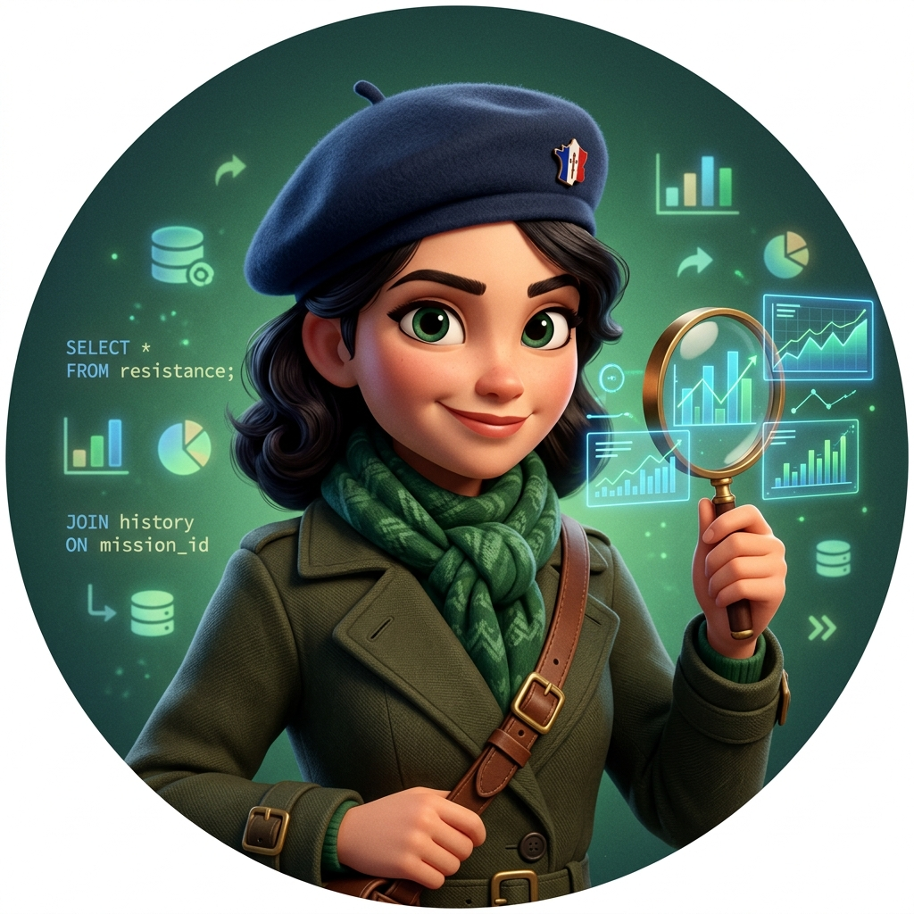
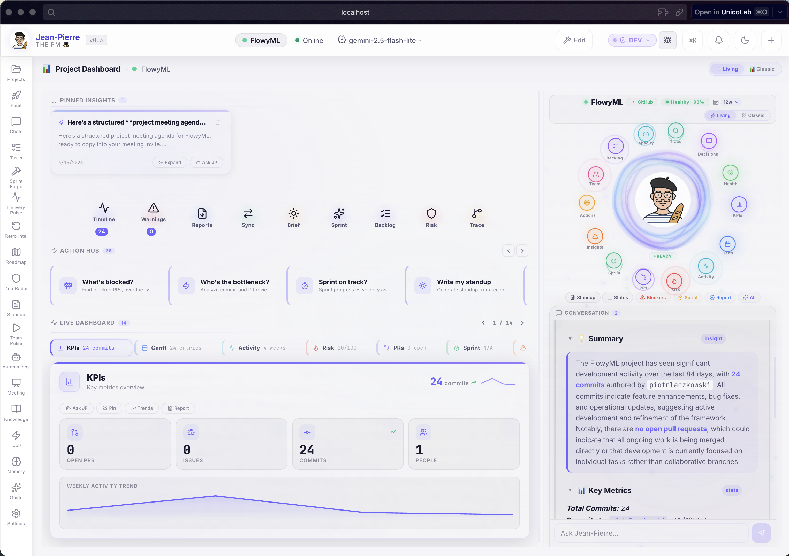
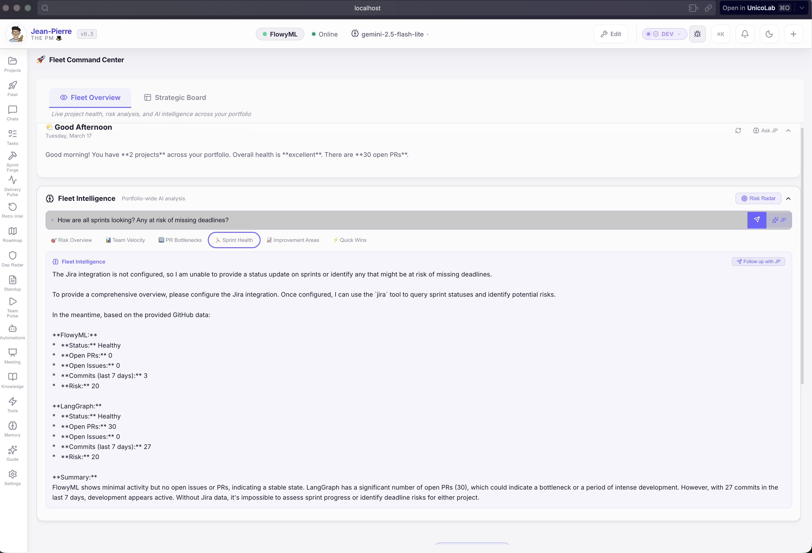
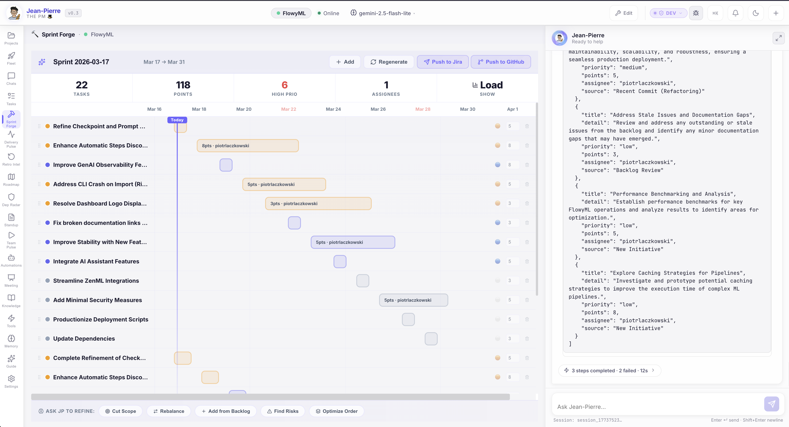
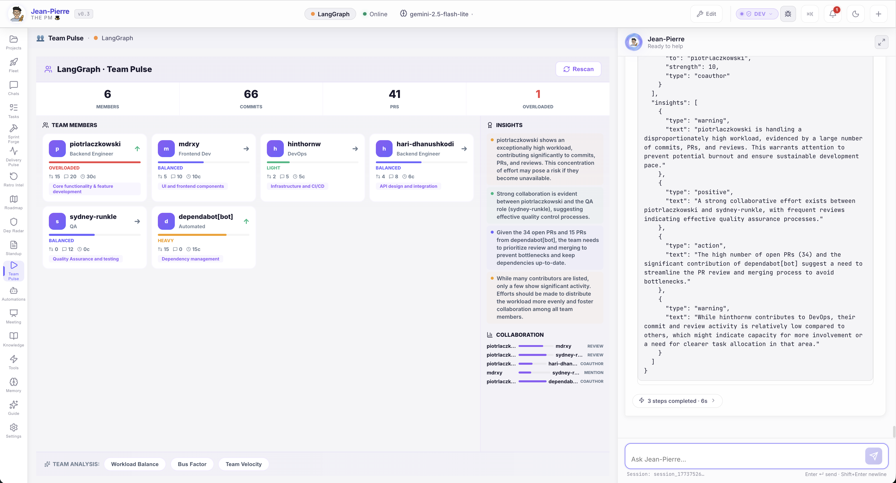
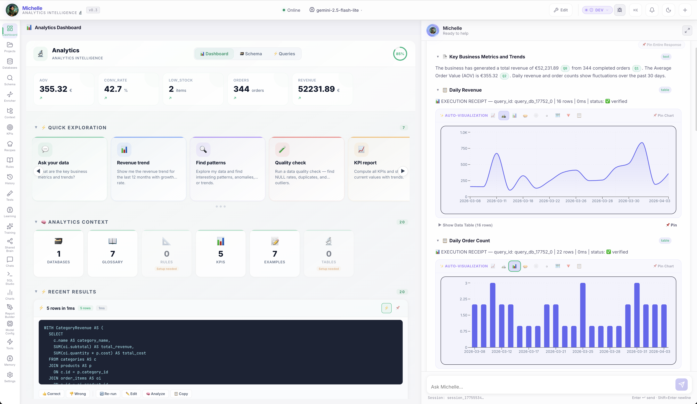
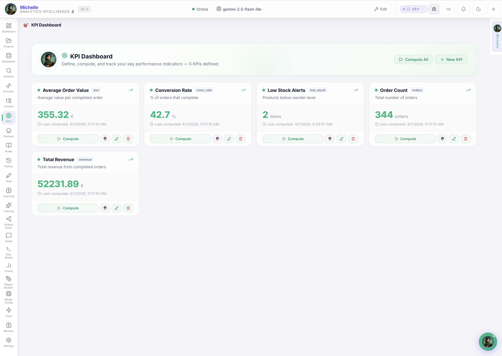
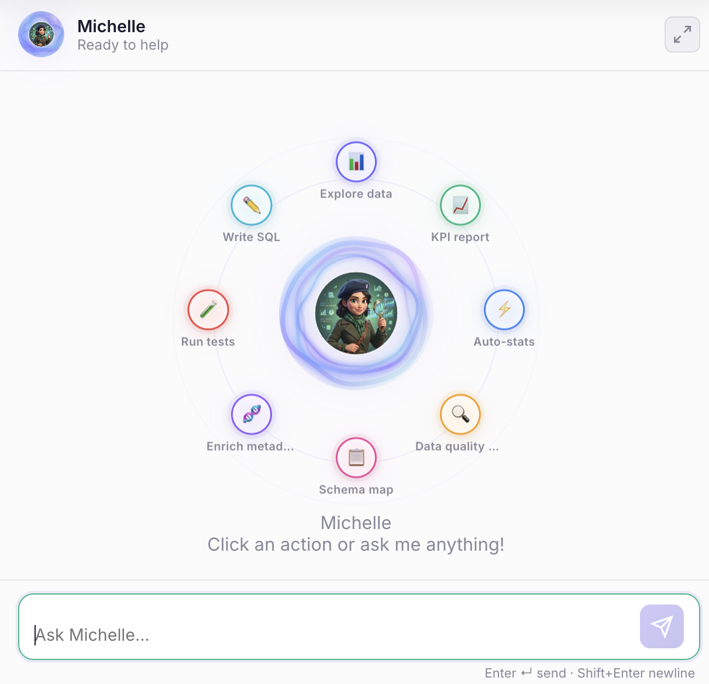
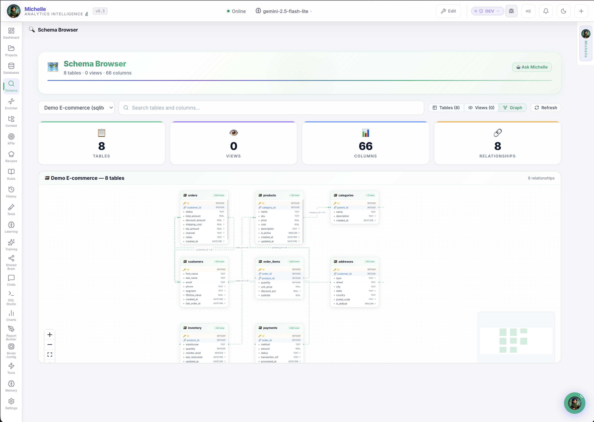

<div class="hero" markdown>

# AgentOS Documentation

<p class="subtitle">
Local-first AI copilots that connect to your tools and run entirely on your machine.<br>
<strong>Install in one command. Configure in the Web UI. Start asking questions.</strong>
</p>

<div class="hero-cta" markdown>

[Get Started :material-rocket-launch:](getting-started/installation.md){ .md-button .md-button--primary }
[Explore Copilots :material-robot:](flavors/index.md){ .md-button }

</div>

</div>

---

## Install

=== "macOS / Linux"

    ```bash
    # Jean-Pierre (PM) — default
    curl -fsSL https://unicolab.github.io/agentos/install.sh | sh

    # Michelle (Analytics)
    curl -fsSL https://unicolab.github.io/agentos/install.sh | sh -s -- --flavour michelle

    # Brigitte (Management)
    curl -fsSL https://unicolab.github.io/agentos/install.sh | sh -s -- --flavour brigitte

    # All agents at once
    curl -fsSL https://unicolab.github.io/agentos/install.sh | sh -s -- --flavour all
    ```

=== "Windows"

    ```powershell
    irm https://unicolab.github.io/agentos/install.ps1 | iex
    ```

=== "Manual"

    ```bash
    # Download the binary for your platform
    tar xzf agentos-pm_*.tar.gz
    mv agentos-pm agentos

    # macOS: clear Gatekeeper
    xattr -rd com.apple.quarantine ./agentos
    codesign --force --sign - ./agentos

    # Run
    ./agentos serve
    ```

Open **http://localhost:18080** after install.

!!! warning "License Required"
    AgentOS requires a license key. Email **[info@unicolab.ai](mailto:info@unicolab.ai)** for a **free testing license**.

---

## Available Copilots

Each copilot is a specialized AI agent with its own persona, tools, and dashboard — all sharing the same engine.

<div class="flagship-duo">

<div class="flagship-hero-card">
<div class="flagship-hero-header">

<div>
<h3>🎩 Jean-Pierre</h3>
<p class="flagship-role">Project Management</p>
</div>
</div>
<div class="flagship-outcomes">
<div class="flagship-outcome"><span>•</span> GitHub + Jira + Slack integration</div>
<div class="flagship-outcome"><span>•</span> Living dashboard with risk scoring</div>
<div class="flagship-outcome"><span>•</span> One-click executive reports</div>
<div class="flagship-outcome"><span>•</span> Fleet view for multi-project portfolios</div>
</div>
<a href="flavors/jean-pierre.md" class="md-button">Learn more →</a>
</div>

<div class="flagship-hero-card flagship-hero-card--michelle">
<div class="flagship-hero-header">

<div>
<h3>🔬 Michelle</h3>
<p class="flagship-role">Analytics Intelligence</p>
</div>
</div>
<div class="flagship-outcomes">
<div class="flagship-outcome"><span>•</span> Connect databases, ask questions in plain English</div>
<div class="flagship-outcome"><span>•</span> Auto-generated and validated SQL</div>
<div class="flagship-outcome"><span>•</span> KPI engine with scheduling and alerts</div>
<div class="flagship-outcome"><span>•</span> Schema auto-discovery and business glossary</div>
</div>
<a href="flavors/michelle.md" class="md-button">Learn more →</a>
</div>

</div>

| Copilot | Install Flag | Domain |
|---------|-------------|--------|
| 🧠 **Brigitte** | `--flavour brigitte` | Management coaching — leadership, team dynamics |

---

## Configure

After install, open the Web UI at `http://localhost:18080` → **Settings**:

### 1. AI Provider

| Provider | Type | Cost | Setup Guide |
|----------|------|------|-------------|
| [Ollama](https://ollama.ai) | Local (on your machine) | Free | [Ollama Setup →](guides/ollama-setup.md) |
| OpenAI | Cloud API | Per-token | Enter API key in Settings |
| Anthropic | Cloud API | Per-token | Enter API key in Settings |
| Google Gemini | Cloud API | Per-token | Enter API key in Settings |

!!! tip "Recommended: Start with Ollama"
    Free, runs locally, and your data never leaves your machine. Install Ollama, pull a model, and configure AgentOS to use it.

### 2. Integrations

| Integration | Copilot | Setup Guide |
|-------------|---------|-------------|
| GitHub | Jean-Pierre | [GitHub Setup →](guides/github-setup.md) |
| Jira | Jean-Pierre | [Jira Setup →](guides/jira-setup.md) |
| Slack | Jean-Pierre | [Slack Setup →](guides/slack-setup.md) |
| Databases (PostgreSQL, MySQL, BigQuery, SQLite) | Michelle | Configure in Settings → Connections |

### 3. License

Enter your license key in **Settings → License**. Need one? Email [info@unicolab.ai](mailto:info@unicolab.ai).

---

## Screenshots

<div class="showcase-section">

<div class="showcase-item">
<div class="showcase-visual">
<div class="showcase-badge">🎩 Jean-Pierre</div>
<div class="carousel-track" id="jp-track">
<div class="carousel-slide"><div class="carousel-caption">Living Dashboard</div></div>
<div class="carousel-slide"><div class="carousel-caption">Fleet View</div></div>
<div class="carousel-slide"><div class="carousel-caption">Sprint Forge</div></div>
<div class="carousel-slide"><div class="carousel-caption">Team Pulse</div></div>
</div>
<div class="carousel-nav">
<button class="carousel-btn" onclick="var t=this.closest('.showcase-visual').querySelector('.carousel-track');t.scrollBy({left:-t.clientWidth,behavior:'smooth'})">❮</button>
<button class="carousel-btn" onclick="var t=this.closest('.showcase-visual').querySelector('.carousel-track');t.scrollBy({left:t.clientWidth,behavior:'smooth'})">❯</button>
</div>
</div>
</div>

<div class="showcase-item">
<div class="showcase-visual">
<div class="showcase-badge">🔬 Michelle</div>
<div class="carousel-track" id="michelle-track">
<div class="carousel-slide"><div class="carousel-caption">Analytics Dashboard</div></div>
<div class="carousel-slide"><div class="carousel-caption">KPI Dashboard</div></div>
<div class="carousel-slide"><div class="carousel-caption">AI Chat</div></div>
<div class="carousel-slide"><div class="carousel-caption">Schema Browser</div></div>
</div>
<div class="carousel-nav">
<button class="carousel-btn" onclick="var t=this.closest('.showcase-visual').querySelector('.carousel-track');t.scrollBy({left:-t.clientWidth,behavior:'smooth'})">❮</button>
<button class="carousel-btn" onclick="var t=this.closest('.showcase-visual').querySelector('.carousel-track');t.scrollBy({left:t.clientWidth,behavior:'smooth'})">❯</button>
</div>
</div>
</div>

</div>

---

## Privacy & Security

All data stays on your machine — conversations, memory, API keys, project data. Nothing is transmitted to UnicoLab except license validation.

Using **Ollama**? Zero cloud communication. Fully air-gap capable.

[Full Security & Privacy Details →](security.md){ .md-button }

---

## Reference

| Resource | Description |
|----------|-------------|
| [Installation Guide](getting-started/installation.md) | Detailed install for all platforms |
| [Quick Start](getting-started/quick-start.md) | 5-minute setup walkthrough |
| [Configuration](getting-started/configuration.md) | All configuration options |
| [CLI Commands](reference/cli.md) | Command-line reference |
| [API Endpoints](reference/api.md) | REST API documentation |
| [Keyboard Shortcuts](reference/keyboard-shortcuts.md) | UI shortcuts |

---

## Part of the AIFlow Ecosystem

AgentOS copilots work standalone but can optionally connect to the [AIFlow platform](https://ai-flow.ai) for centralized portfolio intelligence across teams.

---

<p style="text-align: center; color: var(--md-default-fg-color--light); font-size: 0.9rem;">
<strong>Built with ❤️ by <a href="https://unicolab.ai">UnicoLab</a></strong><br>
Part of the <strong><a href="https://ai-flow.ai">AIFlow</a></strong> ecosystem<br>
© 2024–2026 UnicoLab. All rights reserved.
</p>

<script>
document.addEventListener('DOMContentLoaded', function() {
  document.querySelectorAll('.showcase-visual').forEach(function(visual) {
    var track = visual.querySelector('.carousel-track');
    var dots = visual.querySelectorAll('.carousel-dot');
    if (!track || !dots.length) return;
    track.addEventListener('scroll', function() {
      var idx = Math.round(track.scrollLeft / track.clientWidth);
      dots.forEach(function(d, i) {
        d.classList.toggle('active', i === idx);
      });
    });
  });
});
</script>
